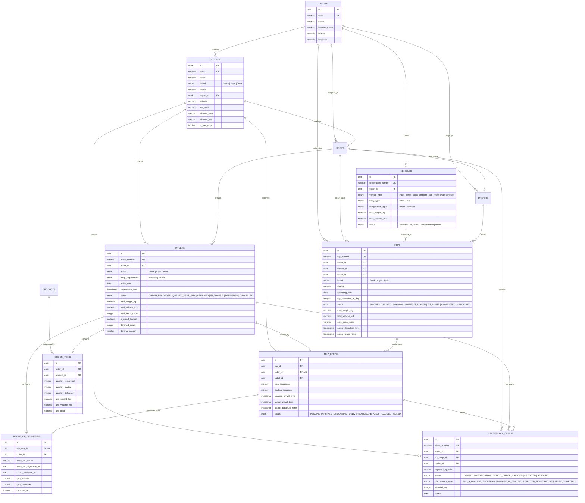

# Waypoint Logistics — Database Relational Schema & Normalization Design

## 1. Normalization Analysis (1NF, 2NF, 3NF, BCNF)

The Waypoint Logistics relational schema is strictly engineered to third normal form (**3NF**) and Boyce-Codd normal form (**BCNF**) across all operational tables.

### 1.1 First Normal Form (1NF)
- **Atomicity**: All column values are atomic scalar types (UUID, VARCHAR, NUMERIC, TIMESTAMP, DATE, INTEGER, BOOLEAN). Addresses and contacts are stored as structured columns rather than nested blobs.
- **No Repeating Groups**: Line items (`order_items`), stops (`trip_stops`), discrepancy records (`discrepancy_claims`), and audit trails (`audit_logs`) reside in dedicated relational child tables.
- **Deterministic Keys**: Every entity has a surrogate UUID primary key (`id UUID PRIMARY KEY DEFAULT gen_random_uuid()`) along with unique natural business keys (`order_number`, `trip_number`, `claim_number`, `registration_number`, `code`).

### 1.2 Second Normal Form (2NF)
- **No Partial Dependencies**: In associative and detail tables such as `order_items` and `trip_stops`, attributes depend fully on the surrogate primary key. Master product specifications (`unit_weight_kg`, `unit_volume_m3`, `unit_price`) are snapshotted on each order item line to preserve historical order fidelity.

### 1.3 Third Normal Form (3NF)
- **No Transitive Dependencies**: Non-key attributes depend exclusively on primary/candidate keys.
  - Store brand, district, and delivery window attributes reside exclusively in `outlets` and are joined when needed rather than repeated in `orders`.
  - Vehicle specs (`vehicle_type`, `body_type`, `refrigeration_type`, `max_weight_kg`) reside in `vehicles`, while drivers reside in `drivers` and `users`.
  - Depot assignment belongs to `outlets.depot_id`, ensuring depot adjustments do not cause update anomalies in historical orders.

### 1.4 Boyce-Codd Normal Form (BCNF)
- For every non-trivial functional dependency $X \rightarrow Y$, $X$ is a superkey.
  - The Fresh dual-order invariant is enforced via candidate superkey unique index `uniq_outlet_date_temp(outlet_id, order_date, temp_requirement)`.
  - The vehicle daily sequence limit is enforced via candidate superkey unique index `uniq_vehicle_date_seq(vehicle_id, operating_date, trip_sequence_in_day)`.

---

## 2. Mermaid Entity-Relationship (ER) Diagram



---

## 3. Relational Table Specifications & Constraints

### 3.1 `depots`
Distribution centers serving as origins for trips and home depots for vehicles.

| Column | Type | Constraints | Description |
| :--- | :--- | :--- | :--- |
| `id` | `UUID` | `PRIMARY KEY DEFAULT gen_random_uuid()` | Surrogate primary key |
| `code` | `VARCHAR(32)` | `NOT NULL UNIQUE` | Natural hub code (`PELIYAGODA`, `KANDY`) |
| `name` | `VARCHAR(128)`| `NOT NULL` | Hub display name |
| `location_name` | `VARCHAR(128)`| `NOT NULL` | Geographical locality |
| `latitude` | `NUMERIC(10,7)`| `NOT NULL` | Depot dock GPS latitude |
| `longitude`| `NUMERIC(10,7)`| `NOT NULL` | Depot dock GPS longitude |

---

### 3.2 `outlets`
Commercial storefronts placing replenishment demand across Colombo, Gampaha, and Kalutara districts.

| Column | Type | Constraints | Description |
| :--- | :--- | :--- | :--- |
| `id` | `UUID` | `PRIMARY KEY DEFAULT gen_random_uuid()` | Surrogate primary key |
| `code` | `VARCHAR(32)` | `NOT NULL UNIQUE` | Natural store code (e.g. `F-COL-01`) |
| `name` | `VARCHAR(128)`| `NOT NULL` | Commercial storefront name |
| `brand` | `brand_type` | `NOT NULL` | `Fresh`, `Style`, `Tech` |
| `district` | `VARCHAR(64)` | `NOT NULL` | Administrative delivery district |
| `depot_id` | `UUID` | `NOT NULL REFERENCES depots(id) ON DELETE RESTRICT` | Supplying fulfillment depot |
| `latitude` | `NUMERIC(10,7)`| `NOT NULL` | Store unloading dock latitude |
| `longitude`| `NUMERIC(10,7)`| `NOT NULL` | Store unloading dock longitude |
| `address` | `TEXT` | `NOT NULL` | Full physical address |
| `contact_phone` | `VARCHAR(32)` | `NOT NULL` | Store manager telephone |
| `window_start` | `VARCHAR(5)` | `NOT NULL DEFAULT '08:00'` | Unloading window open (HH:mm) |
| `window_end` | `VARCHAR(5)` | `NOT NULL DEFAULT '18:00'` | Unloading window close (HH:mm) |
| `is_van_only` | `BOOLEAN` | `NOT NULL DEFAULT FALSE` | Urban street access restriction |
| `is_active` | `BOOLEAN` | `NOT NULL DEFAULT TRUE` | Active operational status |

---

### 3.3 `vehicles`
Fleet registry encompassing 60 commercial units.

| Column | Type | Constraints | Description |
| :--- | :--- | :--- | :--- |
| `id` | `UUID` | `PRIMARY KEY DEFAULT gen_random_uuid()` | Surrogate primary key |
| `registration_number` | `VARCHAR(32)` | `NOT NULL UNIQUE` | Vehicle plate (e.g. `WP-CAD-1029`) |
| `depot_id` | `UUID` | `NOT NULL REFERENCES depots(id) ON DELETE RESTRICT` | Home depot assignment |
| `vehicle_type` | `vehicle_type` | `NOT NULL` | `truck_reefer`, `truck_ambient`, `van_reefer`, `van_ambient` |
| `body_type` | `body_type` | `NOT NULL` | `truck`, `van` |
| `refrigeration_type` | `refrigeration_type` | `NOT NULL` | `reefer`, `ambient` |
| `max_weight_kg` | `NUMERIC(10,2)` | `NOT NULL CHECK (max_weight_kg > 0)` | Maximum payload capacity in kg |
| `max_volume_m3` | `NUMERIC(10,2)` | `NOT NULL CHECK (max_volume_m3 > 0)` | Maximum cubic cargo volume in m³ |
| `status` | `vehicle_status` | `NOT NULL DEFAULT 'available'` | `available`, `in_transit`, `maintenance`, `offline` |

---

### 3.4 `orders`
Authoritative store replenishment demand.

| Column | Type | Constraints | Description |
| :--- | :--- | :--- | :--- |
| `id` | `UUID` | `PRIMARY KEY DEFAULT gen_random_uuid()` | Surrogate primary key |
| `order_number` | `VARCHAR(64)` | `NOT NULL UNIQUE` | Business order number |
| `outlet_id` | `UUID` | `NOT NULL REFERENCES outlets(id) ON DELETE RESTRICT` | Requesting retail store |
| `brand` | `brand_type` | `NOT NULL` | Commercial brand |
| `temp_requirement`| `temp_requirement` | `NOT NULL DEFAULT 'ambient'` | `ambient`, `chilled` |
| `order_date` | `DATE` | `NOT NULL` | Target operating delivery date |
| `submission_time`| `TIMESTAMPTZ` | `NOT NULL DEFAULT NOW()` | Order submission timestamp |
| `status` | `order_status` | `NOT NULL DEFAULT 'ORDER_RECORDED'` | Lifecycle status |
| `total_weight_kg`| `NUMERIC(10,2)` | `NOT NULL DEFAULT 0.00` | Rollup weight in kg |
| `total_volume_m3`| `NUMERIC(10,2)` | `NOT NULL DEFAULT 0.00` | Rollup volume in m³ |
| `total_items_count`| `INTEGER` | `NOT NULL DEFAULT 0` | Total packages ordered |
| `is_cutoff_locked`| `BOOLEAN` | `NOT NULL DEFAULT FALSE` | True if submitted after 16:00 cutoff |
| `deferred_count` | `INTEGER` | `NOT NULL DEFAULT 0` | Anti-starvation deferral counter |
| `last_deferred_date`| `DATE` | `NULLABLE` | Date of last capacity deferral |
| `deferral_reason` | `VARCHAR(255)` | `NULLABLE` | Structured reason for deferral |

**Unique Constraint**:
- `UNIQUE(outlet_id, order_date, temp_requirement)` enforces the Fresh supermarket dual-order invariant (`SM-ORD-002`).

---

### 3.5 `order_items`
Itemized SKU line entries for replenishment orders.

| Column | Type | Constraints | Description |
| :--- | :--- | :--- | :--- |
| `id` | `UUID` | `PRIMARY KEY DEFAULT gen_random_uuid()` | Line item surrogate primary key |
| `order_id` | `UUID` | `NOT NULL REFERENCES orders(id) ON DELETE CASCADE` | Parent order reference |
| `product_id` | `UUID` | `NOT NULL REFERENCES products(id) ON DELETE RESTRICT` | Catalog product reference |
| `quantity_requested` | `INTEGER` | `NOT NULL CHECK (quantity_requested > 0)` | Quantity ordered by store |
| `quantity_loaded` | `INTEGER` | `NOT NULL DEFAULT 0` | Verified quantity loaded at dock |
| `quantity_delivered`| `INTEGER` | `NOT NULL DEFAULT 0` | Quantity received at store dock |
| `unit_weight_kg` | `NUMERIC(8,3)` | `NOT NULL CHECK (unit_weight_kg > 0)` | Historical snapshot weight |
| `unit_volume_m3` | `NUMERIC(8,4)` | `NOT NULL CHECK (unit_volume_m3 > 0)` | Historical snapshot volume |
| `unit_price` | `NUMERIC(12,2)`| `NOT NULL CHECK (unit_price >= 0)` | Historical unit price in LKR |

---

### 3.6 `trips` & `trip_stops`
Planned and executed distribution routes.

```sql
CREATE TABLE trips (
    id UUID PRIMARY KEY DEFAULT gen_random_uuid(),
    trip_number VARCHAR(64) NOT NULL UNIQUE,
    depot_id UUID NOT NULL REFERENCES depots(id) ON DELETE RESTRICT,
    vehicle_id UUID NOT NULL REFERENCES vehicles(id) ON DELETE RESTRICT,
    driver_id UUID NOT NULL REFERENCES drivers(id) ON DELETE RESTRICT,
    brand brand_type NOT NULL,
    district VARCHAR(64) NOT NULL,
    operating_date DATE NOT NULL,
    trip_sequence_in_day INTEGER NOT NULL DEFAULT 1 CHECK (trip_sequence_in_day IN (1, 2)),
    status trip_status NOT NULL DEFAULT 'PLANNED',
    total_weight_kg NUMERIC(10,2) NOT NULL DEFAULT 0.00,
    total_volume_m3 NUMERIC(10,2) NOT NULL DEFAULT 0.00,
    planned_duration_min INTEGER NOT NULL DEFAULT 0,
    actual_departure_time TIMESTAMPTZ,
    actual_return_time TIMESTAMPTZ,
    gate_pass_token VARCHAR(128),
    gate_cleared_by UUID REFERENCES users(id) ON DELETE SET NULL,
    gate_cleared_at TIMESTAMPTZ,
    created_at TIMESTAMPTZ NOT NULL DEFAULT NOW(),
    updated_at TIMESTAMPTZ NOT NULL DEFAULT NOW()
);

-- Maximum 2 trips per vehicle per calendar operating date (Rule 7)
CREATE UNIQUE INDEX uniq_vehicle_date_seq ON trips(vehicle_id, operating_date, trip_sequence_in_day);
```

```sql
CREATE TABLE trip_stops (
    id UUID PRIMARY KEY DEFAULT gen_random_uuid(),
    trip_id UUID NOT NULL REFERENCES trips(id) ON DELETE CASCADE,
    order_id UUID NOT NULL UNIQUE REFERENCES orders(id) ON DELETE RESTRICT,
    outlet_id UUID NOT NULL REFERENCES outlets(id) ON DELETE RESTRICT,
    stop_sequence INTEGER NOT NULL,
    loading_sequence INTEGER NOT NULL,
    planned_arrival_time TIMESTAMPTZ,
    actual_arrival_time TIMESTAMPTZ,
    actual_departure_time TIMESTAMPTZ,
    wait_time_minutes INTEGER NOT NULL DEFAULT 0,
    status trip_stop_status NOT NULL DEFAULT 'PENDING',
    failure_reason VARCHAR(128),
    created_at TIMESTAMPTZ NOT NULL DEFAULT NOW(),
    updated_at TIMESTAMPTZ NOT NULL DEFAULT NOW()
);

-- Stop sequence is unique per trip
CREATE UNIQUE INDEX uniq_trip_stop_seq ON trip_stops(trip_id, stop_sequence);
```

---

### 3.7 `proof_of_deliveries`
Electronic verification recorded by drivers at store delivery docks (`SM-POD-001`).

| Column | Type | Constraints | Description |
| :--- | :--- | :--- | :--- |
| `id` | `UUID` | `PRIMARY KEY DEFAULT gen_random_uuid()` | Surrogate primary key |
| `trip_stop_id` | `UUID` | `NOT NULL UNIQUE REFERENCES trip_stops(id)` | Stop receipt anchor |
| `order_id` | `UUID` | `NOT NULL REFERENCES orders(id)` | Delivered order reference |
| `store_rep_name` | `VARCHAR(128)`| `NOT NULL` | Name of store receiving staff |
| `store_rep_signature_url`| `TEXT` | `NOT NULL` | Base64 / SVG signature artifact |
| `photo_evidence_url` | `TEXT` | `NULLABLE` | Unloading photo evidence URL |
| `driver_notes` | `TEXT` | `NULLABLE` | Driver handover remarks |
| `geo_latitude` | `NUMERIC(10,7)`| `NOT NULL` | Handover GPS latitude |
| `geo_longitude` | `NUMERIC(10,7)`| `NOT NULL` | Handover GPS longitude |
| `captured_at` | `TIMESTAMPTZ` | `NOT NULL DEFAULT NOW()` | Exact handover timestamp |

---

### 3.8 `discrepancy_claims`
Physical receiving discrepancy claims logged by Store Managers (`SM-3`, `SM-DISC-001`) or Loaders (`FAIL-A`).

| Column | Type | Constraints | Description |
| :--- | :--- | :--- | :--- |
| `id` | `UUID` | `PRIMARY KEY DEFAULT gen_random_uuid()` | Surrogate primary key |
| `claim_number` | `VARCHAR(64)` | `NOT NULL UNIQUE` | Business claim identifier (`CLM-YYYYMMDD-XXXX`) |
| `order_id` | `UUID` | `NOT NULL REFERENCES orders(id)` | Affected order reference |
| `trip_stop_id` | `UUID` | `NULLABLE REFERENCES trip_stops(id)` | Associated delivery stop |
| `outlet_id` | `UUID` | `NOT NULL REFERENCES outlets(id)` | Reporting store location |
| `reported_by_role` | `VARCHAR(32)` | `NOT NULL` | `store_manager`, `loader`, `driver` |
| `reported_by_user_id` | `UUID` | `NULLABLE REFERENCES users(id)` | Reporting actor |
| `status` | `discrepancy_status` | `NOT NULL DEFAULT 'LOGGED'` | `LOGGED`, `INVESTIGATING`, `DEFICIT_ORDER_CREATED`, `CREDITED`, `REJECTED` |
| `discrepancy_type` | `discrepancy_type` | `NOT NULL` | `FAIL_A_LOADING_SHORTFALL`, `DAMAGE_IN_TRANSIT`, `REJECTED_TEMPERATURE`, `STORE_SHORTFALL` |
| `shortfall_qty` | `INTEGER` | `NOT NULL DEFAULT 0 CHECK (shortfall_qty >= 0)` | Count of missing or damaged packages |
| `notes` | `TEXT` | `NULLABLE` | Operational remarks |
