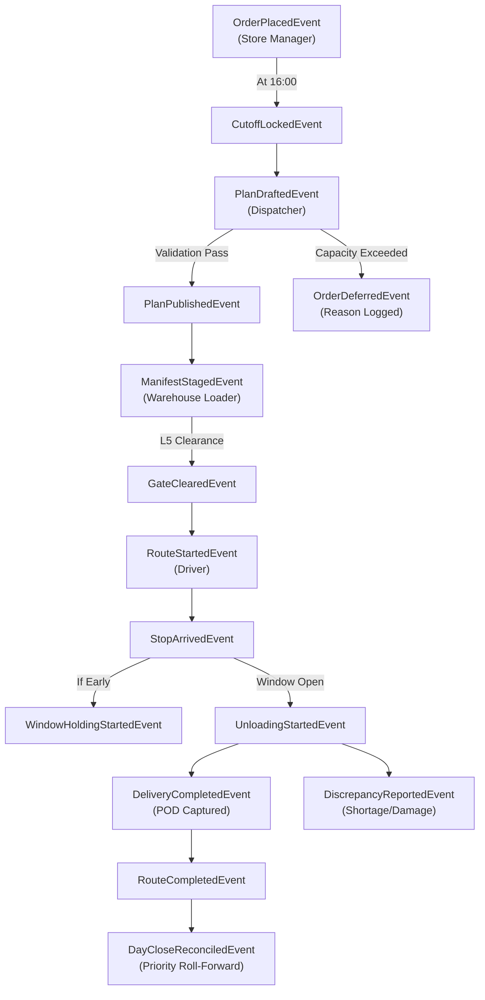

# Waypoint Logistics — Domain Model & Aggregate Design

## 1. Domain-Driven Design (DDD) Overview

The Waypoint Logistics backend models freight execution across Sri Lanka's retail logistics network as an event-driven **Modular Monolith**. The architecture adheres to Domain-Driven Design principles, organizing complex operational invariants into clearly bounded aggregates.

```
+-----------------------------------------------------------------------------------+
|                        WAYPOINT LOGISTICS DOMAIN BOUNDARIES                       |
+-----------------------------------------------------------------------------------+
| [1. IDENTITY & ACCESS BOUNDED CONTEXT]                                            |
|     Users, Roles, Depot Affiliations, Outlet Access Scopes                        |
+-----------------------------------------------------------------------------------+
| [2. NETWORK & MASTER DATA CONTEXT]                                                |
|     Depots, Outlets, Geographical Districts, Inter-Stop Travel Indices            |
+-----------------------------------------------------------------------------------+
| [3. FLEET & CAPACITY CONTEXT]                                                     |
|     Vehicles, Telematics, Refrigeration Sensors, Weekly Fuel Quotas               |
+-----------------------------------------------------------------------------------+
| [4. ORDER & BACKLOG CONTEXT]                                                      |
|     Orders, SKU Line Items, Cutoff Policies, Dual-Order Groups, Deferrals        |
+-----------------------------------------------------------------------------------+
| [5. DISPATCH & PLANNING CONTEXT] (Aggregate Root: Trip)                           |
|     Feasibility Validation, Trip Sequencing, LIFO Loading, Shift Budgets          |
+-----------------------------------------------------------------------------------+
| [6. FULFILLMENT & EXECUTION CONTEXT] (Aggregate Root: Delivery)                   |
|     Stops, Arrival Telematics, Window Wait Timers, Proof of Delivery (POD)        |
+-----------------------------------------------------------------------------------+
| [7. AUDIT & DISCREPANCY CONTEXT]                                                  |
|     Warehouse Shortfalls, Field Exceptions, Discrepancy Claims, Offline Sync      |
+-----------------------------------------------------------------------------------+
```

---

## 2. Core Domain Entities & Value Objects

### 2.1 Identity & Master Data Entities

#### `Depot` (Entity)
- **Identity**: `depot_id` (UUID / Natural Code: `PELIYAGODA`, `KANDY`)
- **Attributes**: `name`, `code`, `province`, `latitude`, `longitude`, `operating_start_time`, `operating_end_time`.
- **Invariants**: Every vehicle and outlet is strictly bound to exactly one depot. Cross-depot servicing is prohibited.
- **Mutability**: Immutable during operational runs.

#### `Outlet` (Entity)
- **Identity**: `outlet_id` (UUID / Natural Code: e.g. `OUT-FR-BOR`)
- **Attributes**: `name`, `brand` (`Fresh`, `Style`, `Tech`), `depot_id`, `district` (e.g. `Colombo`), `address`, `latitude`, `longitude`, `parking_constraint` (`normal`, `van_only`, `mall_dock`), `dock_type` (`rear_dock`, `street`, `mall_bay`), `window_open_min`, `window_close_min`, `mall_window_open_min`, `mall_window_close_min`, `deferred_yesterday`, `days_since_last_served`.
- **Value Objects**:
  - `TimeWindow`: Value object representing $[T_{\text{open}}, T_{\text{close}}]$. Includes `intersects(otherWindow)` and `effectiveWindow()`.
  - `AccessRestriction`: Encapsulates vehicle type compatibility (`requiresVan()`).
- **Mutability**: Operational flags (`deferred_yesterday`, `days_since_last_served`) mutate at day close.

---

### 2.2 Fleet & Resource Entities

#### `Vehicle` (Entity)
- **Identity**: `vehicle_id` (e.g. `WP-012`)
- **Attributes**: `license_plate`, `model`, `depot_id`, `vehicle_type` (`TRUCK`, `VAN`), `thermal_capability` (`REEFER`, `AMBIENT`), `weight_capacity_kg` (Decimal), `volume_capacity_m3` (Decimal), `weekly_fuel_quota_l` (Decimal), `fuel_remaining_l` (Decimal), `km_per_l` (Decimal), `status` (`AVAILABLE`, `IN_WORKSHOP`, `DECOMMISSIONED`), `current_reefer_temp_c` (Decimal), `target_temp_min_c`, `target_temp_max_c`.
- **Invariants**:
  - `status = 'IN_WORKSHOP'` strictly prohibits assignment to any trip.
  - Ambient vehicles cannot carry orders with `temp_requirement = 'chilled'`.
- **Mutability**: `fuel_remaining_l`, `status`, and telemetry (`current_reefer_temp_c`) are mutable.

---

### 2.3 Order Aggregate

#### `Order` (Aggregate Root)
- **Identity**: `order_id` (e.g. `ORD-1041-C`)
- **Attributes**: `order_number`, `outlet_id`, `depot_id`, `brand`, `district`, `order_date`, `temp_requirement` (`ambient`, `chilled`), `total_weight_kg`, `total_volume_m3`, `total_cartons`, `status` (`PENDING`, `CONFIRMED`, `QUEUED_NEXT_RUN`, `ASSIGNED`, `DEFERRED`, `IN_TRANSIT`, `DELIVERED`, `CANCELLED`), `cutoff_locked_at`, `version`.
- **Internal Entities**: `OrderLineItem` (List of SKUs with quantity, weight, and volume).
- **Invariants**:
  - Whole Order Integrity: Cannot be split across multiple trips.
  - Dual-Order Uniqueness: Unique `(outlet_id, order_date, temp_requirement)`.
  - Post-16:00 Lock: Cannot enter active backlog if submitted after 16:00 without supervisor authorization.

#### `OrderLineItem` (Entity)
- **Identity**: `order_line_id`
- **Attributes**: `order_id`, `sku_code`, `product_name`, `category`, `quantity`, `unit_of_measure`, `unit_weight_kg`, `unit_volume_m3`, `is_chilled`.

---

### 2.4 Trip Aggregate (Dispatch & Route Planning)

#### `Trip` (Aggregate Root)
- **Identity**: `trip_id` (e.g. `TRIP-01`)
- **Attributes**: `trip_number` (1 or 2), `operating_date`, `depot_id`, `vehicle_id`, `driver_id`, `brand`, `district`, `departure_planned_min`, `departure_actual_time`, `shift_budget_minutes` (270 for Fresh, 480 for commercial), `calculated_trip_minutes`, `total_weight_kg`, `total_volume_m3`, `status` (`DRAFT`, `PLANNED`, `STAGING`, `CLEARED_DEPARTURE`, `IN_TRANSIT`, `RETURNING`, `COMPLETED`, `CANCELLED`), `gate_cleared_at`, `gate_cleared_by`, `version`.
- **Internal Entities**: `TripStop` (ordered sequence of delivery stops), `TripManifest`.
- **Business Invariants Enforced by Root**:
  - `BR-ALLOC-001`: All stops and orders must share identical `brand` and `district`.
  - `BR-ALLOC-002`: If any order is `chilled`, assigned vehicle must be `reefer`.
  - `BR-ALLOC-003`: If any outlet is `van_only`, assigned vehicle must be `van`.
  - `BR-ALLOC-004`: `vehicle.depot_id == trip.depot_id`.
  - `BR-ALLOC-005`: Total weight $\le W_{\max}$ and Total volume $\le V_{\max}$.
  - `BR-ALLOC-006`: Max 2 trips/vehicle/day. Fresh trip duration $\le 270\text{ min}$; commercial $\le 480\text{ min}$.
  - `BR-LOAD-003`: Departure transition requires `gate_cleared_at IS NOT NULL`.

#### `TripStop` (Entity)
- **Identity**: `trip_stop_id`
- **Attributes**: `trip_id`, `outlet_id`, `sequence` (1-indexed stop order), `lifo_position` (calculated reverse loading position: $N - \text{sequence} + 1$), `dock_type`, `effective_window_open`, `effective_window_close`, `estimated_arrival_min`, `service_allowance_min`, `status` (`SCHEDULED`, `EN_ROUTE`, `ARRIVED`, `WAITING_FOR_WINDOW`, `UNLOADING`, `DELIVERED`, `PARTIALLY_DELIVERED`, `FAILED_EXCEPTION`).

---

### 2.5 Delivery & Fulfillment Aggregate

#### `Delivery` (Aggregate Root)
- **Identity**: `delivery_id`
- **Attributes**: `trip_stop_id`, `order_id`, `actual_arrival_time`, `actual_completion_time`, `holding_wait_minutes`, `status` (`PENDING`, `IN_PROGRESS`, `DELIVERED`, `PARTIAL`, `REFUSED`, `FAILED`), `client_mutation_id`, `version`.
- **Internal Entities**: `ProofOfDelivery`, `DiscrepancyClaim`, `FieldException`.
- **Invariants**:
  - Cannot transition to `DELIVERED` without a valid `ProofOfDelivery` child.
  - If `actual_arrival_time < effective_window_open`, state must pass through `WAITING_FOR_WINDOW` before unloading.

#### `ProofOfDelivery` (Entity)
- **Identity**: `pod_id`
- **Attributes**: `delivery_id`, `recipient_name`, `recipient_designation`, `delivered_cartons`, `expected_cartons`, `outcome` (`FULL`, `PARTIAL`, `DAMAGED`), `signature_storage_uri`, `photo_storage_uri`, `handover_notes`, `captured_at`, `geo_latitude`, `geo_longitude`.

#### `DiscrepancyClaim` / `FieldException` (Entity)
- **Identity**: `claim_id`
- **Attributes**: `delivery_id` (or `trip_id`), `reported_by_role` (`LOADER`, `DRIVER`, `STORE_MANAGER`), `reason_code` (`STORE_CLOSED_UNAVAILABLE`, `DELIVERY_REJECTED`, `DAMAGED_GOODS`, `SHORTAGE_PARTIAL`, `ACCESS_BLOCKED`, `VEHICLE_BREAKDOWN`, `ROAD_WEATHER_DELAY`), `affected_units`, `notes`, `photo_evidence_uri`, `resolution` (`PENDING`, `SHIP_PARTIAL`, `HOLD_REPLACEMENT`, `EMERGENCY_DEFER`, `CLAIM_APPROVED`, `CLAIM_REJECTED`), `reported_at`.

---

## 3. Domain Events (Event-Driven Integration)



### Event Specifications

1. `OrderPlacedEvent`: Emitted when store manager submits daily inventory requisition.
2. `CutoffLockedEvent`: Emitted at 16:00 Asia/Colombo; triggers backlog consolidation and freezes standard ordering.
3. `PlanPublishedEvent`: Emitted by Dispatcher; broadcasts ETAs to Store Managers and LIFO manifests to Warehouse Loaders.
4. `OrderDeferredEvent`: Emitted when an order cannot be accommodated; carries mandatory reason code and increments `days_since_last_served`.
5. `ManifestExceptionEvent` (FAIL-A): Emitted by Loader when punctured cartons or shortages are spotted during staging; triggers live payload recalculation.
6. `GateClearedEvent` (L5): Emitted by Loader; confirms physical truck departure and releases route manifest to Driver mobile client.
7. `DeliveryWindowBreachEvent` (FAIL-D): Emitted when real-time telemetry projects arrival past outlet window close; alerts Dispatcher.
8. `DeliveryCompletedEvent`: Emitted upon driver POD confirmation; notifies Store Manager and central tracking.
9. `SyncReconciledEvent` (FAIL-C): Emitted when an offline driver uploads queued mutations upon cellular signal restoration.
