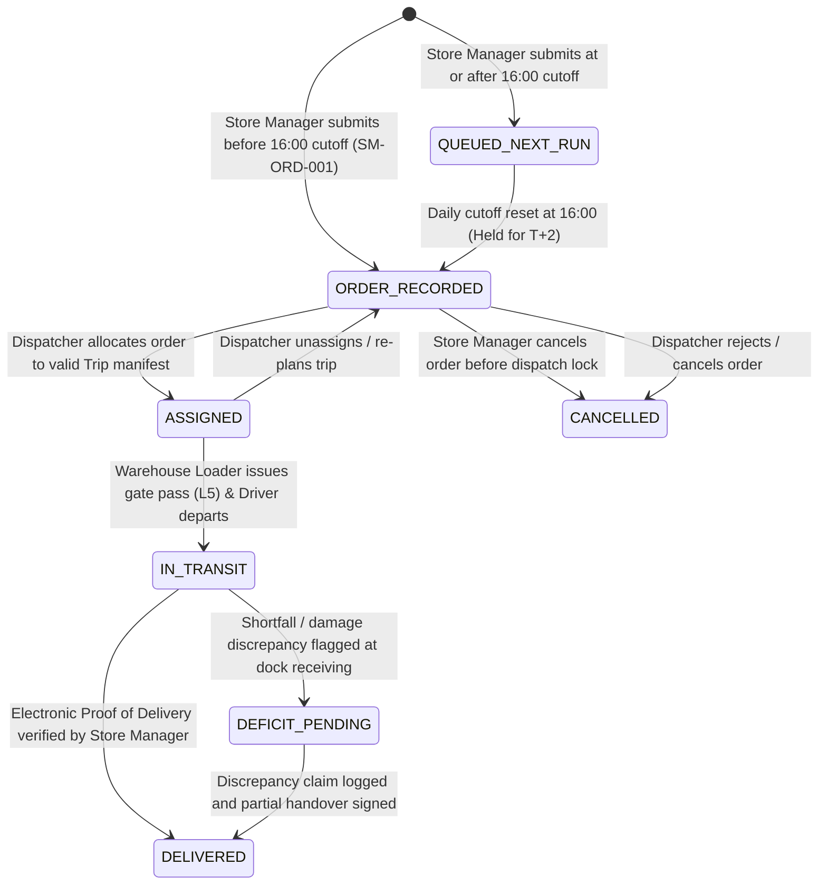
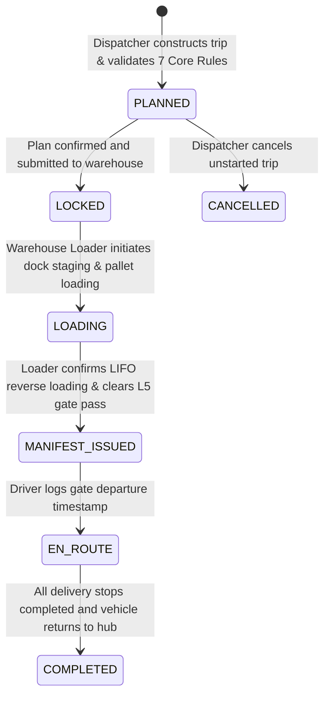
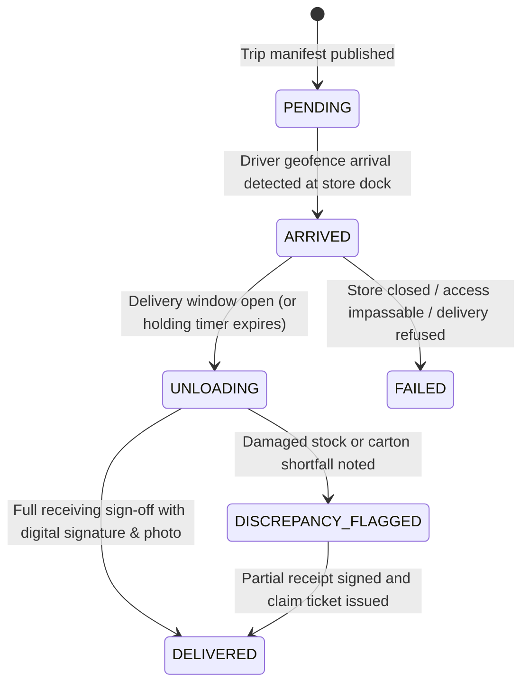
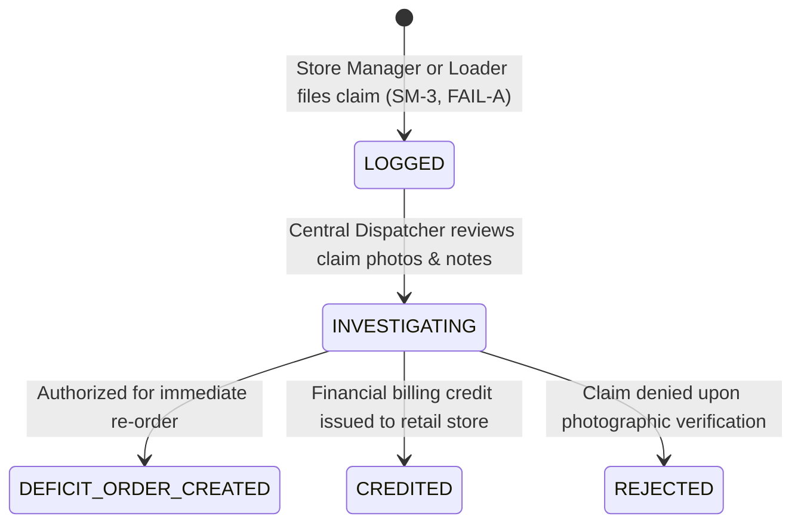

# Waypoint Logistics — Business State Machines & Lifecycle Invariants

## 1. Overview & Transition Principles

In the Waypoint Logistics backend, business states are managed via deterministic finite-state machines (FSM) backed by PostgreSQL native ENUM types (`order_status`, `trip_status`, `trip_stop_status`, `discrepancy_status`).

Every state transition enforces:
1. **Precondition Validation**: Temporal cutoff checks ($<16:00$ vs $\ge 16:00$), physical feasibility checks, and role permissions.
2. **Side Effect Orchestration**: Rollup metric recalculation (weight kg, volume m³), audit logging, and downstream status progression.
3. **Database Integrity**: Transitions occur inside atomic PostgreSQL transactions with optimistic concurrency safeguards.

---

## 2. Order Lifecycle State Machine (`order_status`)

### Transition Matrix: `Order`

| Current State | Action / Trigger | Required Preconditions | Target State | Authorized Actor | Side Effects & Invariants |
| :--- | :--- | :--- | :--- | :--- | :--- |
| **New Entry** | `SUBMIT_ORDER` | Colombo time $< 16:00$; valid brand SKUs; no existing order for temp requirement | `ORDER_RECORDED` | Store Manager | Emits order record; `is_cutoff_locked = false`; scheduled for next-day dispatch ($T+1$). |
| **New Entry** | `SUBMIT_LATE_ORDER` | Colombo time $\ge 16:00$ | `QUEUED_NEXT_RUN` | Store Manager | `is_cutoff_locked = true`; queued for following run ($T+2$). |
| `ORDER_RECORDED` | `ALLOCATE_TO_TRIP` | Passes 7 Core Feasibility Rules; vehicle not in maintenance | `ASSIGNED` | Dispatcher | Links `trip_stops`; updates trip payload weight and cube. |
| `ORDER_RECORDED` | `CANCEL_ORDER` | Order unassigned and pre-cutoff | `CANCELLED` | Store Manager | Releases capacity back to Peliyagoda hub allocation pool. |
| `ASSIGNED` | `DEPART_DEPOT_GATE` | Loader verified LIFO loading & signed gate pass (`L5`) | `IN_TRANSIT` | Driver / Loader | Activates delivery tracking and estimated arrival countdowns. |
| `IN_TRANSIT` | `SUBMIT_POD` | Touch signature, receiver name, and GPS coordinates captured | `DELIVERED` | Driver | Persists `proof_of_deliveries`; completes stop. |
| `IN_TRANSIT` | `FLAG_DISCREPANCY` | Damaged cartons, cold-chain breach, or carton shortfall | `DEFICIT_PENDING` | Driver / Store Mgr | Flags discrepancy; generates `discrepancy_claims` record. |

---

## 3. Trip Lifecycle State Machine (`trip_status`)

### Transition Matrix: `Trip`

| Current State | Action / Trigger | Required Preconditions | Target State | Authorized Actor | Side Effects & Invariants |
| :--- | :--- | :--- | :--- | :--- | :--- |
| `PLANNED` | `LOCK_PLAN` | Passes brand/district homogeneity, capacity bounds, and time budgets | `LOCKED` | Dispatcher | Locks sequence and order assignments. |
| `LOCKED` | `START_STAGING` | Warehouse dock bay assigned | `LOADING` | Warehouse Loader | Displays LIFO reverse loading checklist ($N \to 1$). |
| `LOADING` | `CLEAR_GATE_PASS` | All stops verified in reverse sequence; no unaddressed shortfalls (`FAIL-A`) | `MANIFEST_ISSUED` | Warehouse Loader | Generates `gate_pass_token`; records `gate_cleared_at`. |
| `MANIFEST_ISSUED` | `DEPART_GATE` | Vehicle physically departs Peliyagoda hub yard | `EN_ROUTE` | Delivery Driver | Sets `actual_departure_time`; marks Stop 1 `PENDING`. |
| `EN_ROUTE` | `FINISH_TRIP` | All scheduled stops in `DELIVERED` or `FAILED`; vehicle returns to depot | `COMPLETED` | Delivery Driver / System | Sets `actual_return_time`; frees vehicle for Trip 2 if applicable. |

---

## 4. Delivery Stop Execution State Machine (`trip_stop_status`)

### Transition Matrix: `TripStop`

| Current State | Action / Trigger | Required Preconditions | Target State | Authorized Actor | Side Effects & Invariants |
| :--- | :--- | :--- | :--- | :--- | :--- |
| `PENDING` | `RECORD_ARRIVAL` | Vehicle at outlet loading dock | `ARRIVED` | Delivery Driver | Logs `actual_arrival_time` and GPS coordinates. If arriving before `window_start`, starts early-arrival holding timer. |
| `ARRIVED` | `START_UNLOAD` | Window open ($T \ge \text{window\_start}$) | `UNLOADING` | Delivery Driver | Unlocks dock cargo doors (Stop 1 immediately accessible via LIFO). |
| `UNLOADING` | `RECORD_POD` | Store manager signs receipt; photo captured | `DELIVERED` | Delivery Driver | Creates `proof_of_deliveries` record; marks order `DELIVERED`. |
| `UNLOADING` | `FLAG_DEFICIT` | Damaged cartons or missing units reported | `DISCREPANCY_FLAGGED` | Driver / Store Mgr | Records shortfall quantity; initiates discrepancy claim (`SM-DISC-001`). |
| `ARRIVED` | `FAIL_STOP` | Store gates locked, impassable road, or refusal | `FAILED` | Delivery Driver | Mandatory photo proof and failure reason code required. |

---

## 5. Discrepancy Claims State Machine (`discrepancy_status`)

### Transition Matrix: `DiscrepancyClaim`

| Current State | Action / Trigger | Required Preconditions | Target State | Authorized Actor | Side Effects & Invariants |
| :--- | :--- | :--- | :--- | :--- | :--- |
| `LOGGED` | `START_INVESTIGATION` | Discrepancy claim exists with shortfall count | `INVESTIGATING` | Dispatcher | Reviews driver notes, dock photos, and delivery GPS coordinates. |
| `INVESTIGATING` | `REORDER_DEFICIT` | Replacement stock available at Peliyagoda hub | `DEFICIT_ORDER_CREATED` | Dispatcher | Generates expedited replenishment order for next run. |
| `INVESTIGATING` | `ISSUE_CREDIT` | Shortfall confirmed; item credit applied | `CREDITED` | Dispatcher / Admin | Closes claim ticket with credit note reference. |
| `INVESTIGATING` | `REJECT_CLAIM` | Dock photos prove intact delivery without damage | `REJECTED` | Dispatcher | Retains photo audit record and notifies Store Manager. |
