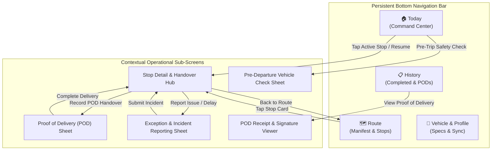
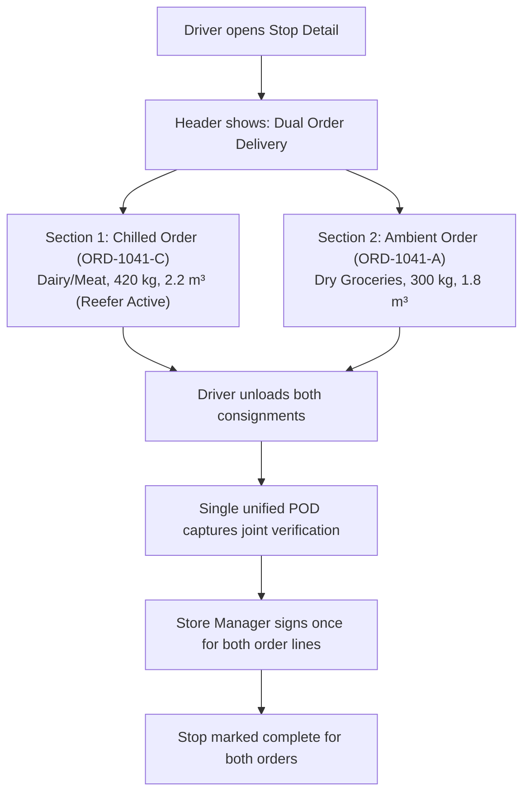
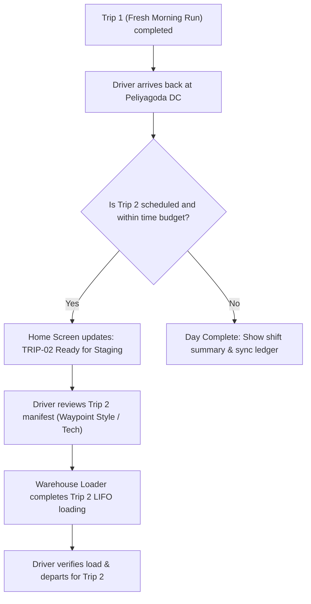
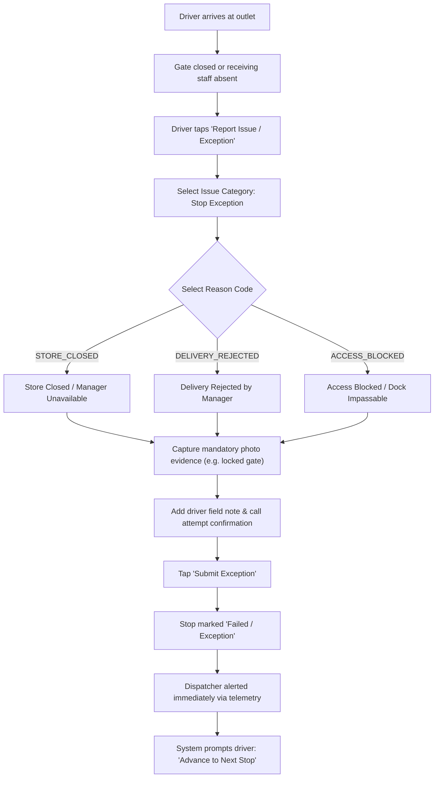
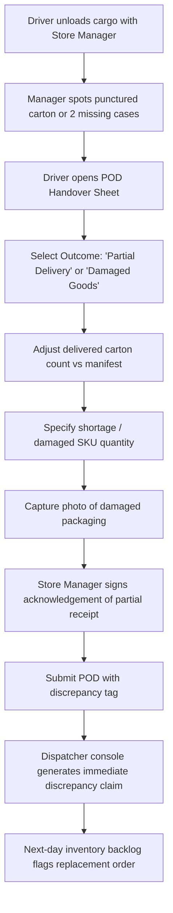
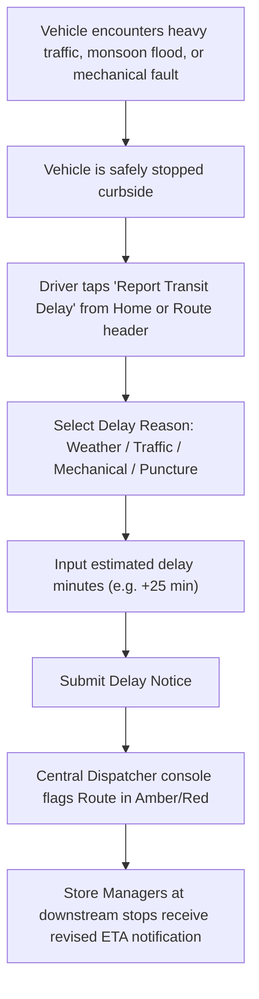
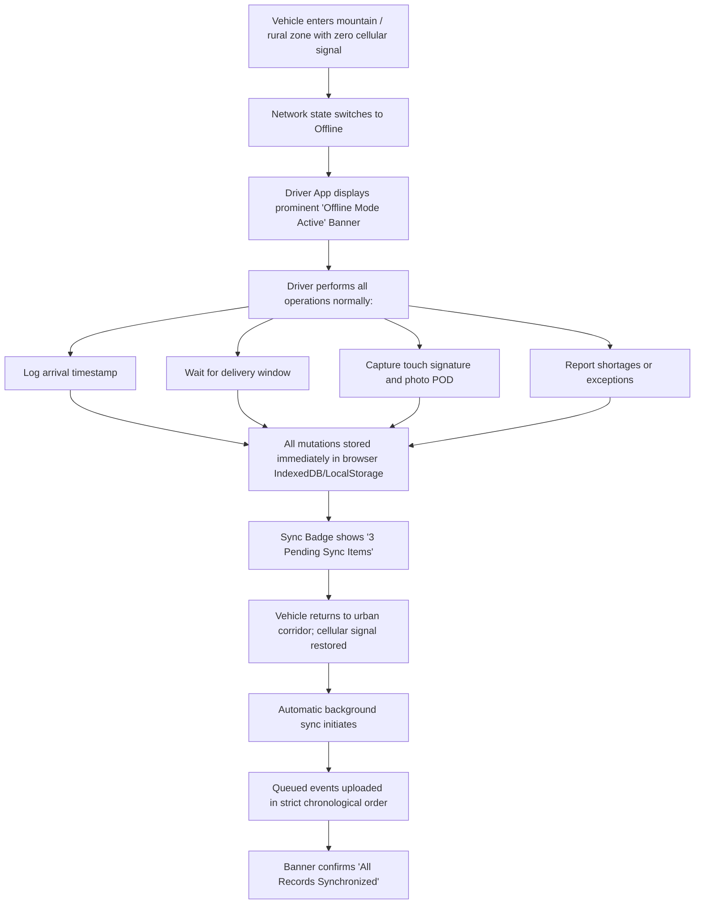

# Waypoint Driver Application — Screen Navigation & Interaction Flows

## 1. Global Navigation Architecture

The Waypoint Driver application employs an ergonomic **Bottom Navigation Bar** optimized for single-handed mobile operation (thumb zone reachability between $360\text{px}$ and $430\text{px}$ viewport width). Operational sub-screens and workflow modals slide in smoothly from the bottom (sheet) or push forward with an immediate, unambiguous Back action.



---

## 2. Primary End-to-End Delivery Flow

This is the standard operational happy path executed for every scheduled route.

```mermaid
sequenceDiagram
  autonumber
  actor D as Driver
  participant App as Driver App (Mobile)
  participant Storage as Local Storage (Offline DB)
  participant Disp as Dispatch Console (Central)

  Note over D,App: Shift Start & Departure
  D->>App: Opens App & Authenticates (DRIV001)
  App->>Storage: Load cached active trip & vehicle data
  App-->>D: Display Driver Home (Today's Assignment: TRIP-01, WP-012)
  D->>App: Tap "Start Route / Depart Depot"
  App->>Storage: Log departure timestamp (e.g. 05:00 AM)
  App->>Disp: Emit departure event (or queue if offline)
  App-->>D: Transition state to In Transit; Show Stop 1 Navigation

  Note over D,App: Stop 1 Transit & Arrival
  D->>App: Arrive at Stop 1 (Fresh · Borella)
  D->>App: Tap "Mark Arrived"
  App->>Storage: Save arrival timestamp & GPS coordinates

  alt Arrived Before Window Open (e.g. 05:15 AM < 05:30 AM)
    App-->>D: Display "Holding for Delivery Window" with live Countdown Timer
    D->>D: Waits in vehicle until 05:30 AM
    App-->>D: Timer expires: Window Open Alert; Unlock Handover button
  else Arrived Inside Window
    App-->>D: Delivery Window Active; Unlock Handover button immediately
  end

  Note over D,App: Physical Handover & POD Capture
  D->>D: Unloads Stop 1 cargo from rear doors (LIFO order)
  D->>App: Tap "Start Handover & Record POD"
  App-->>D: Display POD Handover Sheet
  D->>App: Confirm carton count, input Store Manager Name (e.g. "K. Perera")
  D->>App: Capture Touch Signature & Camera Photo
  D->>App: Tap "Confirm Delivery & Complete Stop"
  App->>Storage: Store signed POD record locally
  App->>Disp: Emit Stop Completed payload (or queue if offline)
  App-->>D: Stop 1 marked "Delivered In Full"; Prompt "Proceed to Stop 2"

  Note over D,App: Stop Iteration & Route Completion
  D->>App: Tap "Navigate to Stop 2"
  Note over D,App: (Repeats arrival & POD for Stop 2: Fresh · Nugegoda)
  App-->>D: All stops completed! Show "Return to Depot" prompt
  D->>App: Tap "Confirm Return to Peliyagoda DC"
  App->>Storage: Save trip close timestamp
  App-->>D: Display Shift Summary; Show Trip 2 readiness or Day Close
```

---

## 3. Alternative Operational Flows

### Flow ALT-1: Same-Outlet Dual Orders (Fresh Dry + Chilled)
When a Fresh outlet has both an Ambient grocery order and a Chilled dairy/meat order on the same vehicle:



### Flow ALT-2: Multi-Trip Shift Execution (Fresh Morning + Style Daytime)
When the vehicle is assigned to execute two trips within daily time budgets:



---

## 4. Exception & Failure Flows

### Flow EXC-1: Delivery Exception (Store Closed / Unreachable / Refused)



### Flow EXC-2: Partial Delivery & Physical Cargo Damage



### Flow EXC-3: Transit Delay & Road Weather Warning (FAIL-D)



### Flow EXC-4: Complete Cellular Outage & Offline Synchronization (FAIL-C)



---

## 5. Screen Transitions & State Map

| From Screen | Trigger Event / User Action | Destination View | Animation / UX Transition |
|---|---|---|---|
| **Home (`MOD-1`)** | Tap "Start Route" | **Home (`MOD-1`)** (updated to En Route) | Instant state switch, Next Stop highlights |
| **Home (`MOD-1`)** | Tap "View Stop Details" or Next Stop Card | **Stop Execution Hub (`MOD-3`)** | Forward slide transition |
| **Home (`MOD-1`)** | Tap "View Manifest" or Route tab | **Route Manifest (`MOD-2`)** | Bottom tab switch |
| **Route (`MOD-2`)** | Tap any Stop Card | **Stop Execution Hub (`MOD-3`)** | Push transition with Stop context |
| **Route (`MOD-2`)** | Tap Map / List toggle | **Route Manifest (`MOD-2`)** (view toggle) | Smooth crossfade between List and Map |
| **Stop Hub (`MOD-3`)** | Tap "Start Handover & POD" | **POD Handover Sheet (`MOD-3.2`)** | Bottom sheet slide-up |
| **Stop Hub (`MOD-3`)** | Tap "Report Issue / Delay" | **Exception Sheet (`MOD-3.3`)** | Modal sheet slide-up |
| **POD Sheet (`MOD-3.2`)** | Tap "Confirm Delivery" | **Stop Hub (`MOD-3`)** $\rightarrow$ Next Stop prompt | Sheet dismisses, success checkmark badge |
| **Stop Hub (`MOD-3`)** | Tap "Next Scheduled Stop" | **Stop Hub (`MOD-3`)** (Next Stop) | Next stop loaded into view |
| **History (`MOD-4`)** | Tap completed Stop item | **POD Receipt Viewer (`MOD-3.2`)** | Read-only drawer slide-up with signature |
| **Profile (`MOD-5`)** | Tap "Sync Now" | **Profile (`MOD-5`)** | Spinner $\rightarrow$ "All items synced" |
