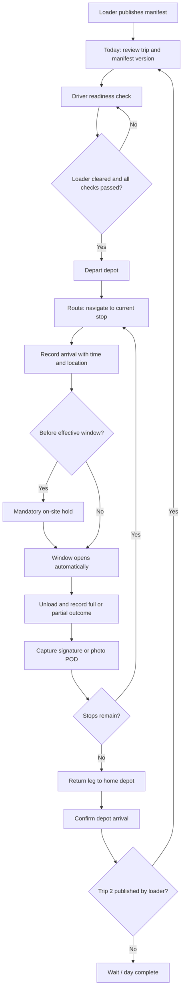

# Driver workspace — normalized screen flow

## Primary flow

## Delivery exception flow

At the current stop, the driver may record `STORE_CLOSED_UNAVAILABLE`, `DELIVERY_REJECTED`, `DAMAGED_GOODS`, or `ACCESS_BLOCKED`. A field note and photo are required. The stop becomes terminal, the order becomes deficit-pending, dispatch is notified, and the driver advances to the next published stop.

Road, weather, or mechanical delay reporting is separate from a stop failure. It can be opened only during an active trip and requires the driver to confirm the vehicle is safely stopped.

## Offline flow

1. Keep the offline banner visible.
2. Persist readiness, departure, arrival, outcome, POD, exception, and return events locally with their original occurrence time.
3. Replay events in chronological order when connectivity returns.
4. Deduplicate by client mutation ID and payload hash.
5. If the server changed the stop while the device was offline, return a conflict. Do not overwrite either state automatically; dispatch reconciles it.

## State gates

### Trip

`MANIFEST_ISSUED → EN_ROUTE → RETURNING → COMPLETED`

- `MANIFEST_ISSUED → EN_ROUTE` requires loader gate clearance and driver readiness.
- `EN_ROUTE → RETURNING` occurs only after every stop is delivered, discrepancy-flagged, or failed.
- `RETURNING → COMPLETED` requires depot geofence confirmation.

### Stop

`PENDING → WAITING_WINDOW | ARRIVED → UNLOADING → DELIVERED | DISCREPANCY_FLAGGED | FAILED`

- Only the earliest unresolved stop can change state.
- `WAITING_WINDOW` cannot unload before `window_hold_until`.
- Arrivals after the effective close time retain `sla_breach` and `sla_breach_minutes`.

## Removed redundancy

- Removed Vehicle/Profile as a fourth bottom-navigation dashboard.
- Removed driver-facing capacity-planning charts and loader-facing LIFO training blocks.
- Removed route-sequence editing and arbitrary execution of future stops.
- Removed separate road incidents from the delivery-exception form.
- Replaced the decorative SVG route with the shared Leaflet implementation.
