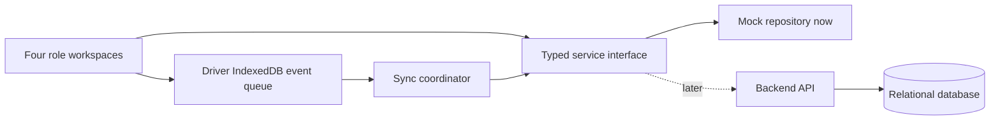

# Waypoint frontend implementation plan

Prepared October 3, 2026, Asia/Colombo. Planning deliverable only; no application code has been created.

## 1. Recommendation and timing

Use **Next.js App Router + TypeScript + Tailwind CSS + shadcn/ui**, with a small shared component system and four role-specific workspaces. Build a connected frontend against a replaceable mock service, then connect the backend through the same contracts.

The team confirmed experience when asked about Next.js/React. This makes Next.js a reasonable choice. Its main value here is routing, shared layouts, and familiar development conventions; SEO is not a deciding factor. React with Vite would also fit this private operations application, but switching frameworks gives little value if the team already knows Next.js.

The booklet starts Day 1 on September 25. October 3 is **Day 9**, and the Hackathon deadline is **October 4 at 23:59 Sri Lanka time**. Frontend-first is workable only with a firm scope boundary. Finishing every optional visual feature before starting the backend would leave the required integrated submission at risk. The schedule below is a proposed timebox, not a completion guarantee.

## 2. Evidence reviewed and prototype diagnosis

Reviewed the booklet, all five supplied planning/source files, the Gemini transcript, and the public prototype. Used Playwright to inspect sign-in and the entry screens for dispatcher, driver, loader, and store manager. Viewed dispatcher at 1280x720 and driver at 390x844; captured loader and store manager at phone size. This was a bounded review, not verification of every prototype interaction or its offline behavior.

Useful existing ideas: dispatcher backlog/vehicle/validation split; carry-over priority; visible cold-chain and access constraints; loader exception and changed-plan states; driver sync status; store delivery timeline.

The observed problems have structural causes:

- **Information competes for space.** Six dispatcher summary cards, a sidebar, three work columns, and a fixed footer compress the primary workspace. Small labels wrap awkwardly. Reduce repeated summaries and reveal detailed validation for the selected trip.
- **Independent sample screens disagree.** The dispatcher shows a five-stop selected trip alongside the booklet's three-order, 101-minute example; driver and loader show nine stops for the example vehicle. Store and dispatch screens use different sample dates. Build all summaries from one normalized scenario.
- **The phone screen prioritizes metadata over work.** Driver summary cards consume most of the first viewport. Bring the next stop and current action forward; move secondary trip details into an expandable manifest.
- **Navigation is incomplete.** Several inspected links point to `#`. Every included destination must resolve to an actual route and state; hide unfinished destinations from the competition build.
- **Displayed certainty exceeds supplied evidence.** Examples include a temperature reading, GPS logging, a movement lock, and late probabilities. Only display these as real when their sources exist; otherwise remove them or label a demonstration estimate.

The user confirmed that the Netlify prototype is not the submitted Day 5 design. The actual submitted artifact is absent, so fidelity cannot yet be assessed. Preserve the documented lifecycle and maintain a README section for significant departures; do not claim Day 5 fidelity has been verified.

## 3. Selected frontend stack

| Layer | Selection | Project-specific purpose |
|---|---|---|
| Framework | Next.js App Router, stable supported release | Four role layouts, navigation, loading/error boundaries |
| Language | TypeScript | Shared order, route, manifest, event, and API contracts |
| Styling | Tailwind CSS | Consistent spacing, responsive layout, semantic tokens |
| Components | shadcn/ui, one primitive family | Accessible buttons, dialogs, sheets, tabs, forms, status feedback |
| Tables | TanStack Table | Backlog, deferrals, fleet filtering and sorting |
| Charts | Recharts through shadcn chart components | One restrained future-capacity view and useful trends |
| Forms | React Hook Form + Zod | Order entry, deferral justification, delivery outcome validation |
| API state | TanStack Query | Reads, mutations, cache invalidation, retry/error presentation |
| Local field storage | Dexie / IndexedDB | Downloaded manifest, proof attachments, durable pending events |
| Offline app shell | Service worker + web manifest | Reload the prepared driver workflow without network access |
| Maps | Leaflet + React-Leaflet, loaded only in browser | Optional depot/stop overview once location data exists |
| Dates | shadcn date picker + Intl formatting | Dispatch date and delivery window selection in Asia/Colombo |
| Icons | Lucide | Bundled consistent icons with text labels |
| Verification | Playwright; focused domain tests | Four-role walkthrough, phone layouts, validation, offline reload/retry |

Pin compatible package versions and commit the lockfile at scaffolding. Verify the installed APIs rather than combining examples from different major releases. In particular, current shadcn documentation may target a different TanStack Table major than older tutorials.

Keep React client components around interactive tables, forms, maps, and the driver workflow. Leaflet requires a browser-only boundary; merely adding `use client` does not by itself remove all prerendering concerns. Server-rendered layouts can remain simple. Avoid making server actions the only write path for offline driver events.

Use local component state for selection and dialogs. Do not add Redux or Zustand unless shared ephemeral UI state actually requires it. TanStack Query manages remote state; IndexedDB manages the durable field queue. Avoid storing the same unsent event in two independent retry queues.

### What to take from the Gemini conversation

Use shadcn primitives, TanStack Table, Recharts, and a single map library. Tremor is optional inspiration, not a second required component system. Plotly, TradingView charts, deck.gl, AG Grid, and math renderers have no demonstrated need for this 60-vehicle operational workflow.

A date picker and dispatch list are enough initially. Add Schedule-X or FullCalendar only if a genuine week/calendar workflow survives scope review. Do not add a paid resource timeline solely to reproduce a dashboard example.

Mapping is separate from routing, allocation, and prediction. Leaflet does not optimize deliveries or provide traffic. The booklet's documented outlet schema does not contain coordinates; no CSV files are present to inspect. Start with a reliable stop list. Any temporary diagram or synthetic coordinates must be labeled illustrative. Road geometry and geocoding need a later verified data source. Public map tiles require attribution and provider-policy compliance; standard OSM tiles do not permit offline bulk downloading.

## 4. Scope and screen inventory

**P0: required connected workflow.** This is the frontend completion target before backend integration.

| Role | Screens / routes | Primary task and important states |
|---|---|---|
| Shared | `/login` | Seeded/demo role entry; errors; role-specific landing |
| Dispatcher | `/dispatch/plan` | Pick operating day/depot; select orders; choose vehicle/trip; validate; record deferrals; publish |
| Dispatcher | `/dispatch/monitor` | Stop progress, loading issues, pending updates, last-known ETA age, receipt discrepancies |
| Dispatcher | `/dispatch/deferrals` | Reason, previous skips, next operating run, override justification for repeated deferral |
| Dispatcher | `/dispatch/reconciliation` | Review offline conflicts and unresolved exceptions; day-close action |
| Loader | `/load`, `/load/trips/[id]` | Vehicle queue; reverse-stop checklist; missing/damaged quantities; version changes; clearance |
| Driver | `/drive`, `/drive/stops/[id]` | Assigned trip; next stop; arrival; early wait; delivery outcome; proof capture |
| Driver | `/drive/sync` | Offline banner, queued events, retry, acknowledged and conflict states |
| Store manager | `/store`, `/store/orders/new` | Order entry; ambient/chilled distinction; cutoff and requested operating date; acceptance confirmation |
| Store manager | `/store/orders/[id]` | Published ETA or explained deferral; delivery outcome; receipt confirmation/discrepancy |

**P1: only after P0 is connected.** Fleet/outlet read-only drawer; future-capacity screen with explicitly seeded estimates; basic map if usable location data becomes available. Capacity planning is in the notes, but Datathon inference integration is explicitly optional for Hackathon.

**Later scope:** trained predictions, routing optimization, live traffic/telematics, full calendar scheduling, barcode camera integration, advanced reporting, extra themes, elaborate motion.

Manual assignment with validation is expressly permitted. Use checkbox/select actions first; drag-and-drop may supplement them later and must never be the sole interaction.

## 5. Proposed UI direction

This is an operational workspace, with task completion as its primary measure of success. The visual direction below is provisional, not an approved replacement design.

- Use a light, high-contrast working surface suitable for warehouse and roadside use. Keep a recognizable Waypoint wordmark and a restrained blue action color. Reserve amber/red for actionable risk; use text and icons alongside color.
- Use a legible workhorse sans-serif or system stack; tabular numerals for times and capacity. Body text should generally remain 14-16px rather than shrinking to fit an overcrowded layout.
- Dispatcher: date/depot header, compact summary strip, backlog table, selected trip workspace, contextual validation panel. At smaller desktop widths, open validation in a drawer instead of forcing three narrow columns.
- Loader: vehicle identity, manifest version, load progress, reverse-stop checklist, and an obvious shortfall action. On phone, one column; on tablet, list/detail layout. Separate physical verification from permission to depart.
- Driver: current trip and next stop first; large current action; visible offline/pending status. Expandable route details and bottom navigation. Allow space for sticky controls and device safe areas.
- Store manager: next delivery or deferral first, order deadline second, receipt action when appropriate. Fresh ambient and chilled orders remain distinct, with distinct ETAs when split across vehicles.

Design loading, empty, failed-save, blocked-action, stale-data, revised-plan, and denied-permission states alongside the normal screens. A failed save keeps the form and explains what can be retried. Pending local capture must not look like confirmed server receipt.

## 6. Domain decisions to resolve before implementation

Use the booklet as authority. Preserve additional team policies only when they do not weaken required feasibility.

| Issue in supplied materials | Implementation decision |
|---|---|
| Primary workflow says time budgets include return trips; booklet Task 2B explicitly excludes return travel from `trip_minutes` | Use the official outbound + inter-stop + handling formula for Task 2B validation. Show actual operational return/wait timing separately |
| Constraint notes permit emergency fuel override; secondary workflow blocks excess fuel | Block over-quota publication; do not invent an unrestricted override |
| Pre-cutoff confirmation described as already scheduled | Distinguish accepted for planning from allocated/published; capacity pressure can still lead to deferral |
| Dual ambient/chilled orders may be visually grouped by outlet | Keep unique order IDs; allocate each whole order once; calculate official per-order allowances without losing an order in grouping |
| Whole-order allocation versus a warehouse partial shipment | Never split an allocation across vehicles/trips. A shortfall is a separate execution exception with revised quantities and an audit trail |
| Calendar operates Monday-Saturday, with exceptions | Use `calendar.csv.is_operating` once supplied; do not schedule Sunday or holiday runs through simple date addition |
| Fuel warning at 85%, ETA watch at 15 minutes, repeated-deferral override | Mark these as configurable team policies; their exact thresholds are not universal booklet requirements |
| Mall gate closes versus ordinary late arrival | Validate mall access and effective window explicitly. Preserve late arrival outcomes; the Datathon scenario still delivers late orders |
| Weekly volume compared with theoretical fleet volume | Label as a rough capacity estimate; volume alone cannot prove feasibility under weight, access, fuel, and time constraints |

Preflight should also exclude workshop vehicles; enforce brand/district per trip, depot parity, refrigeration, van access, weight AND volume, whole orders, and maximum two trips. Fresh durations share a 270-minute daily budget; Style and Tech share 480 minutes in a separate window. No third trip is allowed.

## 7. Frontend-first architecture and backend handoff



Use one normalized mock repository for all roles, persisted between browser reloads. Components call a typed service rather than importing unrelated arrays. The mock service applies the same state transitions that the API will eventually implement. Invalidation refreshes affected views; explicit refresh or a small polling interval is sufficient initially. Do not require WebSockets for the first integrated demo.

Suggested entities: `Outlet`, `Vehicle`, `OperatingDate`, `Order`, `Plan`, `Trip`, `TripStop`, `LoadException`, `DeliveryEvent`, `ProofAttachment`, `Receipt`, `Deferral`, and `SyncConflict`. Keep plan and manifest versions. Weight, volume, fuel, and duration values always include units. Treat mutable progress, sync state, and allocation as separate fields.

Suggested API contract surface: session lookup; order create/list/detail; planning-day backlog/fleet; validate draft; publish plan; loader manifest and exception resolution; trip departure; delivery event batch; proof upload; store receipt/discrepancy; conflict review; day close. Backend validation and authorization remain authoritative even if frontend validation gives immediate feedback.

Proposed structure:

```text
apps/web/src/
  app/                  # role routes and layouts
  components/ui/        # copied shadcn primitives
  components/shared/    # status, capacity, time window, entity drawer
  features/             # dispatch, load, drive, store
  lib/api/              # typed service interface and HTTP adapter
  lib/domain/           # schemas, statuses, policy, validation contracts
  lib/offline/          # IndexedDB, attachment storage, synchronization
  mocks/                # one repository and independent demonstration fixtures
docs/                   # plan, architecture, data model, disclosure, walkthrough
```

Define these boundaries now, but defer backend framework selection to the implementation decision. Python/FastAPI could align with later Python modeling; Next.js route handlers could reduce initial services. The browser API contract should accommodate either. Do not add Python services merely because the Datathon exists: model integration is not required.

## 8. Offline behavior is part of frontend completion

Before departure, cache the driver shell and download the assigned manifest. Persist each arrival, outcome, and proof reference in IndexedDB before displaying “Saved on this device.” Every event has a unique ID, actor, order/trip ID, plan version, occurrence timestamp, and sync state. Keep evidence blobs locally until upload is acknowledged.

Use an explicit outbox as the single durable source of pending field writes. Synchronize on reconnection, app open, and manual retry. Background synchronization is an enhancement, not the only recovery path. Detect unreachable API as well as browser connection state. On acknowledgment, mark the event synced; on duplicate submission the backend returns the existing result; on version conflict preserve the local evidence and show both versions for dispatcher review.

The mock phase can exercise these transitions with simulated acknowledgments and conflicts, but cannot prove real server reconciliation. Do not describe mock recovery as production synchronization.

The driver must still see the manifest and record proof after losing the network and reloading. If the app was never prepared online, show a specific “No downloaded trip” state. If maps are unavailable offline, continue with the stop list. Do not silently discard an outbox on logout/account switch or when an attachment fails to upload.

## 9. Build sequence and decision gates

1. **Contracts and foundation (roughly 1-2 focused hours):** confirm statuses, role access, validation rules, dispatch date, fixture scenario, route skeleton, shared tokens, service interface, and offline spike. Select compatible stable dependencies and lock them.
2. **Connected P0 frontend (roughly 6-8 focused hours):** build dispatcher allocation and publication, loader exception/clearance, driver arrival/outcome/proof, store ETA/receipt, and sync/conflict views. Follow one scenario through all roles. These are scope caps; if they slip, cut P1.
3. **Frontend gate:** build and type-check succeed; role routes resolve; changes propagate between roles; invalid allocation is blocked; deferral has a reason; offline local capture survives reload. Begin backend integration here instead of spending remaining time on optional dashboards.
4. **Backend integration:** seed accounts and supplied reference data, implement authoritative validation/status transitions and idempotent event ingestion, connect the HTTP adapter, and verify persistence across different role sessions.
5. **Submission gate:** run the fresh Docker Compose install and public walkthrough; verify real offline recovery; finish README, root `.env.example`, architecture/data model, AI disclosure, seeded account instructions, and the 5-8 minute video. Reserve a meaningful buffer before October 4, 23:59 for failures and uploads.

The CSVs and official `check_allocation.py` are absent. Independent demo fixtures can unblock UI work but cannot satisfy the final requirement to seed the shared datasets. Obtain the organizer-provided files through authorized access before the integration gate. The booklet places dataset-use and sharing restrictions on competition data; keep fixtures independent and do not upload datasets to external research tools or publish them indiscriminately.

## 10. Acceptance checks

- A store order is accepted for a specific operating date and appears in the correct depot backlog.
- Dispatcher assigns a whole order once; a chilled order on an ambient vehicle, truck at van-only outlet, overload, wrong depot, mixed brand/district, excess fuel, and third trip are blocked with explanations.
- A prior deferral has visible history and a new reason; store sees a deferral instead of an unsupported ETA.
- Published manifest version reaches loader and driver. Loading follows reverse delivery sequence; a shortfall requires resolution before clearance. A changed loaded plan requires reverification.
- Driver captures arrival/outcome/proof offline, reloads, and retains the queued records. Repeated submission creates one server record after integration; conflicts preserve evidence.
- Store confirms receipt separately from driver delivery; discrepancies become visible to dispatch.
- Playwright checks dispatcher at representative desktop widths and loader/driver at 390px and a narrower phone width; also inspect store at phone and desktop sizes. No clipped controls, obscured focused fields, or color-only status.
- Focused domain tests cover boundary capacities, two separate time budgets, cutoff/operating dates, and event idempotency. After integration, run the supplied allocation checker against a generated compatible scenario if applicable.

## 11. Documentation sources

- [Next.js App Router](https://nextjs.org/docs/app) and [PWA guide](https://nextjs.org/docs/app/guides/progressive-web-apps).
- [shadcn chart composition](https://ui.shadcn.com/docs/components/chart) and [data tables](https://ui.shadcn.com/docs/components/data-table).
- [React Leaflet browser rendering limitations](https://react-leaflet.js.org/docs/start-introduction/).
- [Dexie React integration](https://dexie.org/docs/Tutorial/React).
- [OSM tile usage policy](https://operations.osmfoundation.org/policies/tiles/).

Context7 was used to check Next.js, shadcn/ui, and TanStack Query documentation. No library installation or application tests have been performed in this planning task. Open decisions are actual Day 5 fidelity, backend preference, eventual location data, and supplied datasets. The recommendation does not depend on adding more libraries.
