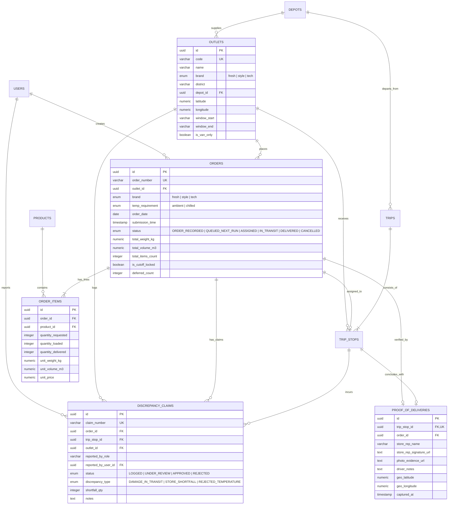

# Waypoint Logistics — Store Manager Database Design

## 1. Domain Relational Modeling Overview

The Store Manager data model forms the demand-side anchor of the Waypoint Logistics Management System. It models the creation, lifecycle progression, delivery fulfillment, and receiving verification of store replenishment orders across three retail brand categories:

- **Fresh Supermarkets** (Dual ambient & chilled temperature handling)
- **Style Apparel** (Single daily ambient delivery, hanging & boxed garments)
- **Tech Electronics** (Single daily ambient delivery, high-value serial-tracked items)

The data model is strictly normalized, enforces referential integrity through PostgreSQL foreign keys and check constraints, and uses strategic composite indexes optimized for store-scoped operational queries.

---

## 2. Normalization Analysis (1NF through BCNF)

### First Normal Form (1NF)
- **Atomic Attributes**: All columns store atomic scalar values (UUID, VARCHAR, NUMERIC, TIMESTAMP, BOOLEAN). No repeating groups, arrays of items, or pipe-delimited strings are stored in relational columns.
- **Unique Row Identification**: Every entity has a surrogate primary key `id UUID DEFAULT gen_random_uuid()` as well as unique natural business keys (`order_number`, `claim_number`, `code`).

### Second Normal Form (2NF)
- **No Partial Dependencies**: All non-key attributes are fully functionally dependent on the entire primary key. In associative tables like `order_items` and `trip_stops`, attributes such as `unit_weight_kg`, `unit_volume_m3`, and `unit_price` are captured at order line creation to prevent transitive anomalies if master product specs change over time.

### Third Normal Form (3NF)
- **No Transitive Dependencies**: Non-key attributes do not depend on other non-key attributes. For example:
  - Store district and brand belong exclusively to `outlets`, not duplicated across `orders`.
  - Product weight and volume belong to `products` (and snapshot-captured in `order_items` for historical fidelity).
  - Depot assignment belongs to `outlets.depot_id`, ensuring depot changes don't cause update anomalies in `orders`.

### Boyce-Codd Normal Form (BCNF)
- For every functional dependency $X \rightarrow Y$, $X$ is a superkey.
  - The composite business constraint on orders `(outlet_id, order_date, temp_requirement)` is enforced via a unique index `uniq_outlet_date_temp`, which acts as an alternate candidate superkey.

---

## 3. Entity-Relationship Diagram (Mermaid)



---

## 4. Detailed Table Definitions & Integrity Constraints

### 4.1. `orders` Table
Authoritative demand record submitted by the Store Manager.

```sql
CREATE TABLE orders (
    id UUID PRIMARY KEY DEFAULT gen_random_uuid(),
    order_number VARCHAR(64) NOT NULL UNIQUE,
    outlet_id UUID NOT NULL REFERENCES outlets(id) ON DELETE RESTRICT,
    brand brand_enum NOT NULL,
    temp_requirement temp_requirement_enum NOT NULL DEFAULT 'ambient',
    order_date DATE NOT NULL,
    submission_time TIMESTAMPTZ NOT NULL DEFAULT NOW(),
    status order_status_enum NOT NULL DEFAULT 'ORDER_RECORDED',
    total_weight_kg NUMERIC(10, 2) NOT NULL DEFAULT 0.00,
    total_volume_m3 NUMERIC(10, 2) NOT NULL DEFAULT 0.00,
    total_items_count INTEGER NOT NULL DEFAULT 0,
    is_cutoff_locked BOOLEAN NOT NULL DEFAULT FALSE,
    deferred_count INTEGER NOT NULL DEFAULT 0,
    last_deferred_date DATE,
    deferral_reason VARCHAR(255),
    created_by UUID REFERENCES users(id) ON DELETE SET NULL,
    created_at TIMESTAMPTZ NOT NULL DEFAULT NOW(),
    updated_at TIMESTAMPTZ NOT NULL DEFAULT NOW()
);

-- Integrity Constraints
CREATE UNIQUE INDEX uniq_outlet_date_temp ON orders(outlet_id, order_date, temp_requirement);
CREATE INDEX idx_orders_outlet_date ON orders(outlet_id, order_date DESC);
CREATE INDEX idx_orders_status_date ON orders(status, order_date DESC);
CREATE INDEX idx_orders_brand_status ON orders(brand, status);
```

#### Delete Behavior Rationale
- `outlet_id REFERENCES outlets(id) ON DELETE RESTRICT`: Outlets cannot be dropped if historical orders exist, safeguarding financial audits.
- `created_by REFERENCES users(id) ON DELETE SET NULL`: If a Store Manager user account is deactivated, the order record persists with null user attribution.

---

### 4.2. `order_items` Table
Itemized line entries for each SKU requested in an order.

```sql
CREATE TABLE order_items (
    id UUID PRIMARY KEY DEFAULT gen_random_uuid(),
    order_id UUID NOT NULL REFERENCES orders(id) ON DELETE CASCADE,
    product_id UUID NOT NULL REFERENCES products(id) ON DELETE RESTRICT,
    quantity_requested INTEGER NOT NULL CHECK (quantity_requested > 0),
    quantity_loaded INTEGER NOT NULL DEFAULT 0 CHECK (quantity_loaded >= 0),
    quantity_delivered INTEGER NOT NULL DEFAULT 0 CHECK (quantity_delivered >= 0),
    unit_weight_kg NUMERIC(8, 3) NOT NULL CHECK (unit_weight_kg > 0),
    unit_volume_m3 NUMERIC(8, 4) NOT NULL CHECK (unit_volume_m3 > 0),
    unit_price NUMERIC(12, 2) NOT NULL CHECK (unit_price >= 0),
    created_at TIMESTAMPTZ NOT NULL DEFAULT NOW(),
    updated_at TIMESTAMPTZ NOT NULL DEFAULT NOW()
);

CREATE INDEX idx_order_items_order ON order_items(order_id);
CREATE INDEX idx_order_items_product ON order_items(productId);
```

#### Delete Behavior Rationale
- `order_id REFERENCES orders(id) ON DELETE CASCADE`: Line items are strictly owned by the order. If an uncommitted draft or cascading order is purged, line items are cleaned up automatically.
- `product_id REFERENCES products(id) ON DELETE RESTRICT`: Products referenced in existing orders cannot be deleted from the SKU master catalog.

---

### 4.3. `proof_of_deliveries` Table
Digital evidence of physical receiving at the store loading dock (`SM-POD-001`).

```sql
CREATE TABLE proof_of_deliveries (
    id UUID PRIMARY KEY DEFAULT gen_random_uuid(),
    trip_stop_id UUID NOT NULL UNIQUE REFERENCES trip_stops(id) ON DELETE RESTRICT,
    order_id UUID NOT NULL REFERENCES orders(id) ON DELETE RESTRICT,
    store_rep_name VARCHAR(128) NOT NULL,
    store_rep_signature_url TEXT NOT NULL,
    photo_evidence_url TEXT,
    driver_notes TEXT,
    geo_latitude NUMERIC(10, 7) NOT NULL,
    geo_longitude NUMERIC(10, 7) NOT NULL,
    captured_at TIMESTAMPTZ NOT NULL DEFAULT NOW(),
    created_at TIMESTAMPTZ NOT NULL DEFAULT NOW(),
    updated_at TIMESTAMPTZ NOT NULL DEFAULT NOW()
);

CREATE INDEX idx_pod_order ON proof_of_deliveries(order_id);
```

---

### 4.4. `discrepancy_claims` Table
Receiving discrepancy claims logged by Store Managers (`SM-DISC-001`).

```sql
CREATE TABLE discrepancy_claims (
    id UUID PRIMARY KEY DEFAULT gen_random_uuid(),
    claim_number VARCHAR(64) NOT NULL UNIQUE,
    order_id UUID NOT NULL REFERENCES orders(id) ON DELETE RESTRICT,
    trip_stop_id UUID REFERENCES trip_stops(id) ON DELETE SET NULL,
    outlet_id UUID NOT NULL REFERENCES outlets(id) ON DELETE RESTRICT,
    reported_by_role VARCHAR(32) NOT NULL,
    reported_by_user_id UUID REFERENCES users(id) ON DELETE SET NULL,
    status discrepancy_status_enum NOT NULL DEFAULT 'LOGGED',
    discrepancy_type discrepancy_type_enum NOT NULL,
    shortfall_qty INTEGER NOT NULL DEFAULT 0 CHECK (shortfall_qty >= 0),
    notes TEXT,
    created_at TIMESTAMPTZ NOT NULL DEFAULT NOW(),
    updated_at TIMESTAMPTZ NOT NULL DEFAULT NOW()
);

CREATE INDEX idx_discrepancy_order ON discrepancy_claims(order_id);
CREATE INDEX idx_discrepancy_outlet ON discrepancy_claims(outlet_id);
CREATE INDEX idx_discrepancy_status ON discrepancy_claims(status);
```

---

## 5. Query Optimization & Index Justifications

| Query Pattern | Table | Index Used | Rationale |
| :--- | :--- | :--- | :--- |
| **Store Overview Recent Orders** | `orders` | `idx_orders_outlet_date(outlet_id, order_date DESC)` | Instant index scan for an outlet's active and historical orders, avoiding full table scans. |
| **Dual Order Verification (`SM-ORD-002`)** | `orders` | `uniq_outlet_date_temp(outlet_id, order_date, temp_requirement)` | B-Tree unique index provides $O(\log N)$ conflict detection on insert/submit. |
| **Order Detail Lines Fetch** | `order_items` | `idx_order_items_order(order_id)` | Single seek on foreign key fetches all items for an order modal in $<1\text{ms}$. |
| **Store Discrepancy History** | `discrepancy_claims`| `idx_discrepancy_outlet(outlet_id)` | Isolates claims for the logged-in Store Manager's outlet. |
| **Inbound Delivery Tracker** | `trip_stops` | `idx_trip_stops_outlet_status(outlet_id, status)` | Fast filtration for stops currently `IN_TRANSIT` or `ARRIVED` heading to the manager's store. |
