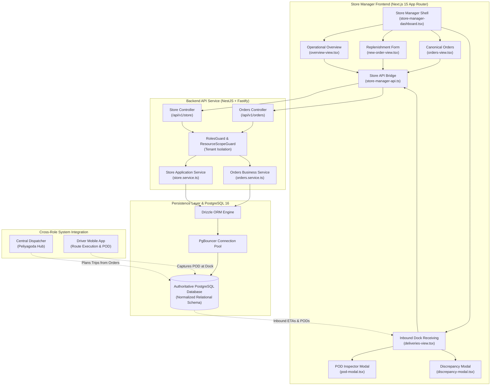

# Waypoint Logistics — Store Manager Implementation Report

## 1. Executive Summary

This report documents the design, architecture, and production-grade implementation of the **Store Manager Application / Domain** within the Waypoint Logistics Management System.

The Store Manager module anchors the demand-side operations of the supply chain, handling daily replenishment ordering, strict operational 16:00 cutoff enforcement, Fresh supermarket dual-temperature order handling, inbound split-delivery visibility, proof of delivery verification, and physical receiving discrepancy reporting.

---

## 2. End-to-End System Architecture

---

## 3. Implemented Business Capabilities & Operational Rules

| Rule ID | Operational Constraint | Implementation Details |
| :--- | :--- | :--- |
| **`SM-ORD-001`** | **16:00 Colombo Cutoff** | Orders submitted $<16:00$ Colombo time are classified as `ORDER_RECORDED` for next-day dispatch ($T+1$). Orders submitted $\ge 16:00$ are locked into `QUEUED_NEXT_RUN` ($T+2$). |
| **`SM-ORD-002`** | **Fresh Dual-Order Invariant** | Fresh supermarkets can submit at most 1 ambient and 1 chilled order per delivery date (`UNIQUE(outlet_id, order_date, temp_requirement)`). Style and Tech are locked to ambient. |
| **`SM-ORD-003`** | **Brand SKU Isolation** | Products belonging to other brands cannot be ordered. Enforced at DTO validation and database foreign keys. |
| **`SM-ORD-005`** | **Pre-Cutoff Cancellation** | Store Managers can cancel only an unlocked `ORDER_RECORDED` order before the live 16:00 Colombo cutoff. `QUEUED_NEXT_RUN` and all later states are locked. |
| **`ALT-1`** | **Split Delivery Visibility** | When Fresh ambient and chilled orders are split across separate vehicles due to reefer capacity constraints, Store Managers see dual delivery cards with distinct driver details, vehicle plates, and ETAs. |
| **`SM-POD-001`** | **Electronic Receiving Handover** | Displays store receiver name, digital signature URL, delivery timestamp, and GPS dock geofence coordinates ($<50\text{m}$ radius). |
| **`SM-DISC-001`** | **Receiving Discrepancy Claims** | Store Managers log claims (`DAMAGE_IN_TRANSIT`, `STORE_SHORTFALL`, `REJECTED_TEMPERATURE`) with shortfall quantities, generating unique claim numbers forwarded to the Dispatcher. |
| **`SM-SEC-001`** | **Resource Scope Isolation** | Store Managers are locked to their assigned `outletId` extracted from validated JWT session tokens, preventing cross-store IDOR attacks. |

---

## 4. Frontend Architecture & Normalized Views

Directory: `apps/web/src/features/store-manager/`

1. **`store-manager-dashboard.tsx`**:
   - Master layout with a fixed assigned-outlet context, real-time sync, and three non-redundant destinations (`Today`, `Orders`, `Receiving`). `Create Order` is a guided drill-down from Orders rather than a duplicate navigation destination.
2. **`overview-view.tsx`**:
   - Store Profile Header (Code, Brand, Address, Delivery Window `08:00 - 18:00`).
   - Cutoff Timer Card: Real-time countdown clock to 16:00 Colombo deadline with schedule notification.
   - Today's Inbound Delivery Cards (`ALT-1`): Split delivery visibility with driver contact and live ETA.
   - Operational KPI Row: Immediate counts for `Recorded`, `Queued`, `In Transit`, and `Delivered`.
   - Recent Orders Table.
3. **`new-order-view.tsx`**:
   - Replenishment Ordering Form (`SM-1`): Target delivery date selection, ambient vs chilled toggle, SKU catalog search & category filtering, stepper quantity selectors (+/-), live cart weight and volume rollup, and cutoff validation.
4. **`orders-view.tsx`**:
   - Canonical Orders Data Table: Search by order number, filter pills (`ALL`, `RECORDED`, `QUEUED`, `ASSIGNED`, `IN_TRANSIT`, `DELIVERED`, `CANCELLED`).
   - Order Detail Drawer: Manifest item lines with unit weights and prices, and pre-cutoff cancellation action.
5. **`deliveries-view.tsx`**:
   - Inbound Shipments & Receiving Center (`SM-3`): Live status, carrier telematics, and discrepancy alert sections.
6. **`pod-modal.tsx` & `discrepancy-modal.tsx`**:
   - Modals for digital proof of delivery receipt inspection and physical discrepancy logging.

---

## 5. Backend REST API Implementation

| HTTP Method | Route | Authorized Roles | Functionality |
| :--- | :--- | :--- | :--- |
| `GET` | `/api/v1/store/overview` | `store_manager`, `admin`, `dispatcher` | Aggregated operational overview (profile, cutoff clock, active counts, inbound deliveries). |
| `GET` | `/api/v1/store/deliveries` | `store_manager`, `admin`, `dispatcher` | Detailed inbound delivery runs with split vehicle ETAs and POD receipts. |
| `POST` | `/api/v1/store/discrepancies`| `store_manager`, `admin` | Logs receiving discrepancy claims upon physical unloading (`SM-3`). |
| `GET` | `/api/v1/store/discrepancies` | `store_manager`, `admin`, `dispatcher` | Fetches discrepancy history for the store. |
| `POST` | `/api/v1/orders` | `store_manager`, `dispatcher`, `admin` | Validates business rules, cutoff time, dual-order invariant, and persists order atomically. |
| `GET` | `/api/v1/orders` | `store_manager`, `dispatcher`, `admin` | Lists replenishment orders scoped to the Store Manager's outlet. |
| `POST` | `/api/v1/orders/:id/cancel` | `store_manager`, `dispatcher`, `admin` | Pre-cutoff order cancellation. |

---

## 6. Automated Testing & Verification Results

### 6.1. Backend API Test Suite (`apps/api`)
Command: `npm run test:api`
- **Result**: 5 test files, **26 passing tests**, 0 failures.
  - `test/e2e/store-manager.spec.ts` (Store overview, split ETAs, POD inspection, discrepancy claims, and tenant scope isolation).
  - `test/unit/lifo-and-cutoff.spec.ts` (Cutoff classification and LIFO reverse sequencing).
  - `test/unit/feasibility-rules.spec.ts` (Fleet capacity and temperature constraints).
  - `test/e2e/connection-pool.spec.ts` (PgBouncer connection pool integrity).
  - `test/e2e/api-validation.spec.ts` (Health and readiness contracts).

### 6.2. Frontend Type & Build Verification (`apps/web`)
- Command: `npm --prefix apps/web run typecheck`
- **Result**: `next typegen && tsc --noEmit` exited with code 0 (**Zero TypeScript errors**).

### 6.3. Backend Production Bundle (`apps/api`)
- Command: `npm --prefix apps/api run build`
- **Result**: `nest build` exited with code 0 (**Zero compilation errors**).

---

## 7. Assumptions & Production Readiness

1. **Local Colombo Time Reference**: Operating cutoff calculations strictly evaluate Sri Lanka Standard Time ($UTC + 05:30$) so server location does not distort cutoff enforcement.
2. **District Routing Attribution**: Outlets are supplied strictly by the central hub at Peliyagoda across Colombo, Gampaha, and Kalutara districts.
3. **Zero Paid Infrastructure**: The solution runs completely on open-source PostgreSQL 16, PgBouncer, Fastify, Next.js, and Redis without proprietary paywalls.
