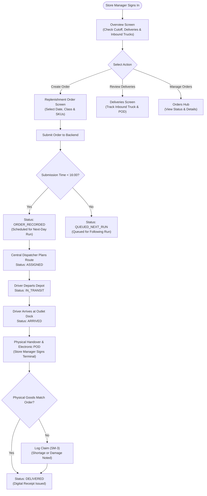
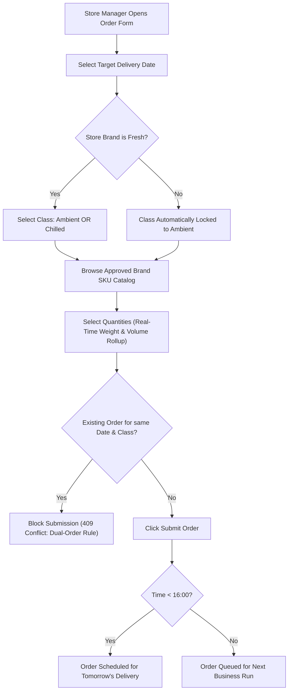
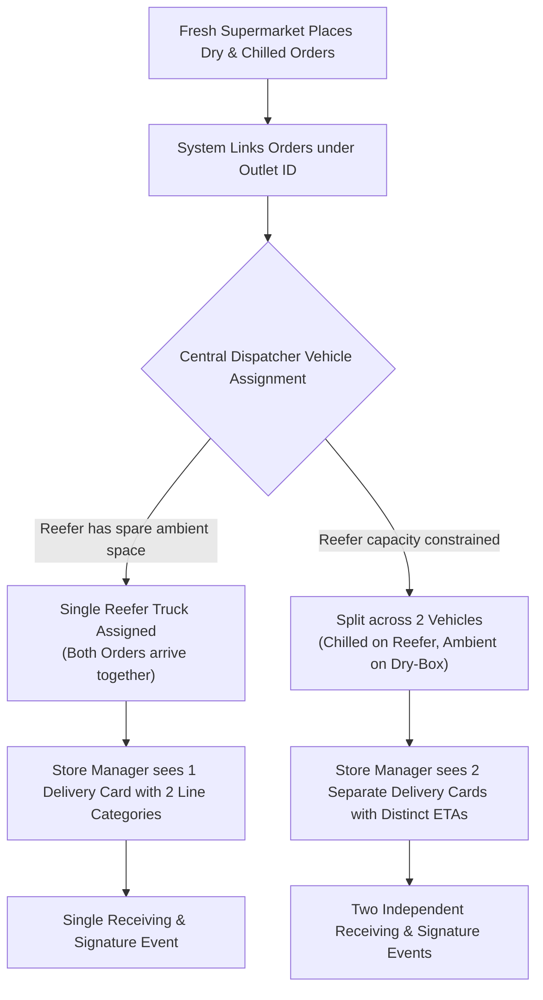
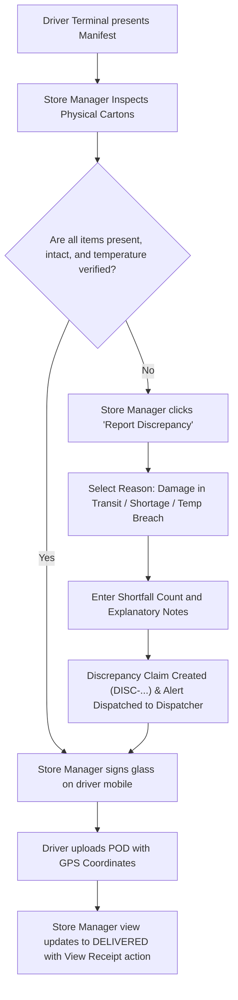

# Store Manager Screen Flow & Workflow Diagrams — Waypoint Logistics

## 1. End-to-End Operational Lifecycle Flow

---

## 2. Pre-Cutoff Order Placement Flow (`SM-1`)

---

## 3. Fresh Dual-Order Split Delivery Flow (`ALT-1`)

---

## 4. Delivery Handover & Discrepancy Flow (`SM-3`)

