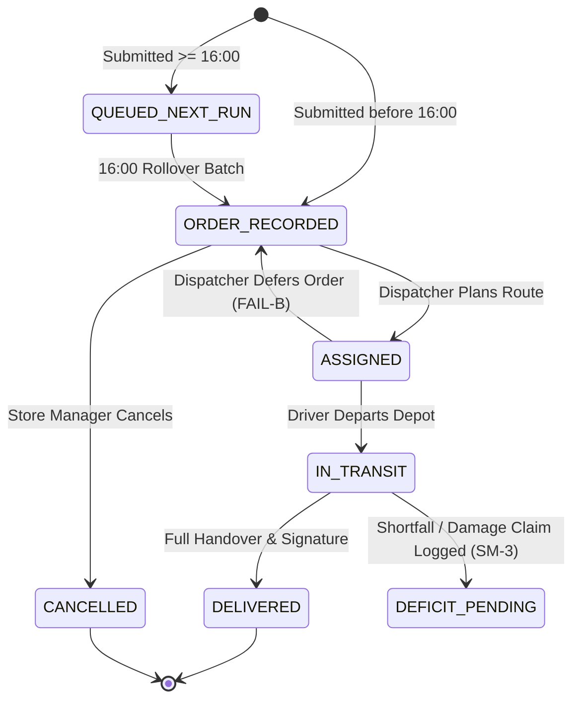

# Store Manager State Model & Lifecycle Transitions — Waypoint Logistics

## 1. Order State Lifecycle Matrix

The Store Manager interacts with official backend statuses. Frontend components map strictly to these standardized states without inventing ad-hoc strings.

```text
+-------------------+-----------------------------------------------------------------------------------------------+
| Status Code       | Operational Meaning for Store Manager                                                         |
+-------------------+-----------------------------------------------------------------------------------------------+
| ORDER_RECORDED    | Order placed before 16:00 cutoff. Confirmed in backlog for tomorrow's delivery.               |
|                   | Actions allowed: View details, Cancel order (Pre-cutoff only).                                |
+-------------------+-----------------------------------------------------------------------------------------------+
| QUEUED_NEXT_RUN   | Order placed at or after 16:00 cutoff. Locked from tomorrow's run, queued for following cycle.  |
|                   | Actions allowed: View details, Cancel order.                                                  |
+-------------------+-----------------------------------------------------------------------------------------------+
| ASSIGNED          | Central Dispatcher incorporated order onto a planned vehicle trip. Manifest is locked.        |
|                   | Actions allowed: View assigned trip number, vehicle registration, and planned delivery date. |
+-------------------+-----------------------------------------------------------------------------------------------+
| IN_TRANSIT        | Vehicle cleared warehouse gate pass and is actively en route on the road.                     |
|                   | Actions allowed: Track live delivery status, view expected arrival window.                    |
+-------------------+-----------------------------------------------------------------------------------------------+
| DELIVERED         | Cargo unloaded, receiving rep name recorded, digital signature captured with GPS coordinates.  |
|                   | Actions allowed: Inspect digital Proof of Delivery, View/Print delivery receipt.              |
+-------------------+-----------------------------------------------------------------------------------------------+
| DEFICIT_PENDING   | Handover completed with logged shortages or damages. Claim under investigation by Dispatcher. |
|                   | Actions allowed: View discrepancy claim details, track credit / replacement order.            |
+-------------------+-----------------------------------------------------------------------------------------------+
| CANCELLED         | Order cancelled before cutoff. Terminal state.                                                |
|                   | Actions allowed: View cancellation record.                                                    |
+-------------------+-----------------------------------------------------------------------------------------------+
```

---

## 2. Order State Transition Diagram



---

## 3. Allowed Actions by State Matrix

| State | Edit Quantities | Cancel Order | View Assigned Vehicle | View Live ETA | Inspect Digital POD | File Claim |
| :--- | :---: | :---: | :---: | :---: | :---: | :---: |
| `ORDER_RECORDED` | ⚠️ Re-order / New | ✅ YES | ❌ Not yet | ❌ Not yet | ❌ No | ❌ No |
| `QUEUED_NEXT_RUN`| ⚠️ Re-order / New | ❌ Cutoff locked | ❌ Not yet | ❌ Not yet | ❌ No | ❌ No |
| `ASSIGNED` | ❌ Locked | ❌ Locked | ✅ YES | ⚠️ Planned Window| ❌ No | ❌ No |
| `IN_TRANSIT` | ❌ Locked | ❌ Locked | ✅ YES | ✅ Live ETA | ❌ No | ❌ No |
| `DELIVERED` | ❌ Terminal | ❌ Terminal | ✅ YES | 🏁 Delivered | ✅ YES | ✅ YES (`SM-3`) |
| `CANCELLED` | ❌ Terminal | ❌ Terminal | ❌ No | ❌ No | ❌ No | ❌ No |
