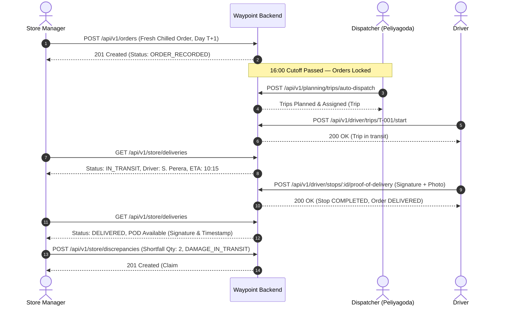

# Waypoint Logistics — Store Manager Testing Strategy

## 1. Overview & Test Pyramid

The Store Manager testing strategy ensures commercial-grade reliability across demand capture, business rule enforcement, split ETA visibility, receiving verification, and multi-tenant security isolation.

```text
               / \
              /   \      E2E Cross-Role Integration (Playwright / Supertest)
             / E2E \     - Store Manager creates order
            /-------\    - Dispatcher plans trip & runs algorithm
           /   API   \   - Driver starts trip, arrives, records POD
          /  Contract \  - Store Manager inspects POD & logs discrepancy
         /-------------\
        /  Integration  \ Database Transactions, Concurrency & Tenant Guards
       /-----------------\
      /     Unit Tests    \ Business Rules: 16:00 Cutoff, Dual-Orders, Weight/Vol
     /---------------------\
```

---

## 2. Test Suites & Coverage Targets

| Test Level | Scope | Tools | Target Coverage | Key Focus Areas |
| :--- | :--- | :--- | :--- | :--- |
| **Unit Tests** | Business Domain Logic | Vitest / Jest | $>95\%$ | Cutoff calculation (`SM-ORD-001`), Fresh dual-order validation (`SM-ORD-002`), Pre-cutoff cancellation (`SM-ORD-005`), Weight/volume computation. |
| **Database Integration** | PostgreSQL Constraints | Supertest + Real DB | $100\%$ of schema rules | Unique constraints (`uniq_outlet_date_temp`), cascade vs restrict rules, transaction rollbacks. |
| **API Contract Tests** | Controller & Services | Supertest / Fastify Inject | $100\%$ of endpoints | Status codes, schema validation, error payload structure, header authentication. |
| **Security & Negative Tests**| Authorization & IDOR | Automated scripts | Zero vulnerability | `ResourceScopeGuard` cross-outlet isolation, invalid transitions, expired JWTs. |
| **Cross-Role E2E Tests** | System Lifecycle | Supertest / Playwright | 100% of primary flows | End-to-end flow from order creation to driver delivery and receiving discrepancy. |

---

## 3. Unit Test Scenarios

### 3.1. Cutoff Validation (`SM-ORD-001`)
- **TC-CUTOFF-01**: Given current system time is `14:30` on day $T$ with delivery date $T+1$, submission succeeds with status `ORDER_RECORDED` and `isCutoffLocked = false`.
- **TC-CUTOFF-02**: Given current system time is `16:05` on day $T$ with delivery date $T+1$, submission is queued with status `QUEUED_NEXT_RUN` and `isCutoffLocked = true`.
- **TC-CUTOFF-03**: Given current system time is `15:59:59`, submission is classified as pre-cutoff.

### 3.2. Brand & Temperature Validation (`SM-ORD-002`, `SM-ORD-003`)
- **TC-BRAND-01**: Fresh supermarket outlet can place one `ambient` order and one `chilled` order for the same delivery date.
- **TC-BRAND-02**: Attempting to place a second `ambient` order for the same date on a Fresh outlet throws `DUPLICATE_ORDER_EXCEPTION`.
- **TC-BRAND-03**: Style and Tech outlets attempting to place a `chilled` order are rejected with `INVALID_TEMPERATURE_REQUIREMENT`.
- **TC-BRAND-04**: An order containing SKUs belonging to another brand is rejected with `BRAND_MISMATCH_EXCEPTION`.

### 3.3. Order Cancellation Rules (`SM-ORD-005`)
- **TC-CANCEL-01**: Order in `ORDER_RECORDED` state cancelled before 16:00 transitions to `CANCELLED`.
- **TC-CANCEL-02**: Order in `ASSIGNED` or `IN_TRANSIT` state throws `ORDER_LOCKED_EXCEPTION` when cancellation is attempted.

---

## 4. API & Integration Test Scenarios

### 4.1. Store Overview & Deliveries
- **TC-API-01**: `GET /api/v1/store/overview` returns store metadata, operational countdown, active orders, and today's delivery cards.
- **TC-API-02**: `GET /api/v1/store/deliveries` returns split delivery cards for Fresh stores when ambient and chilled orders are assigned to separate vehicles (`ALT-1`).
- **TC-API-03**: When POD is recorded, Store Manager can fetch signature and geo-coordinates from `/api/v1/store/deliveries`.

### 4.2. Discrepancy Logging (`SM-DISC-001`, `SM-3`)
- **TC-DISC-01**: `POST /api/v1/store/discrepancies` with `DAMAGE_IN_TRANSIT` creates a verified claim linked to the order and outlet.
- **TC-DISC-02**: Submitting discrepancy for an order not in `DELIVERED` status returns `400 Bad Request`.

---

## 5. Security & Negative Test Scenarios (`SM-SEC-001`)

### 5.1. IDOR / Tenant Scope Protection
- **TC-SEC-01**: Store Manager for Outlet A requests `GET /api/v1/orders/:id` where `:id` belongs to Outlet B. Returns `403 Forbidden` (`OUTLET_ACCESS_DENIED`).
- **TC-SEC-02**: Store Manager attempts to create an order supplying `outletId` of another store in request body. Backend overrides or rejects with `403 Forbidden`.
- **TC-SEC-03**: Unauthenticated request to `/api/v1/store/overview` returns `401 Unauthorized`.

---

## 6. Cross-Role Integration Workflow (`SM-1` $\rightarrow$ `DISP-1` $\rightarrow$ `DRV-1` $\rightarrow$ `SM-3`)


